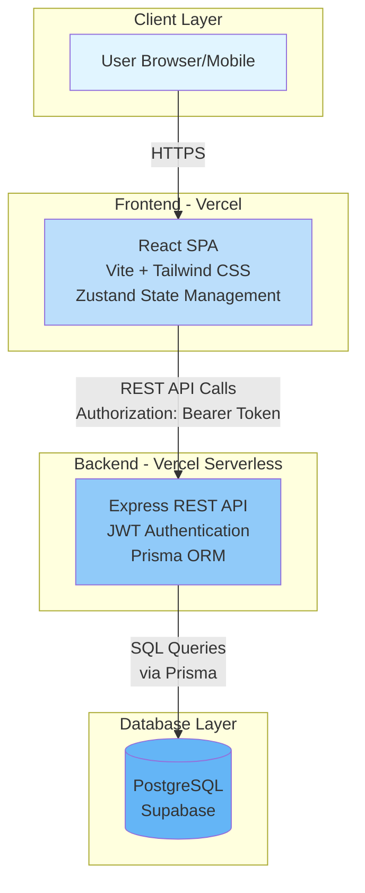
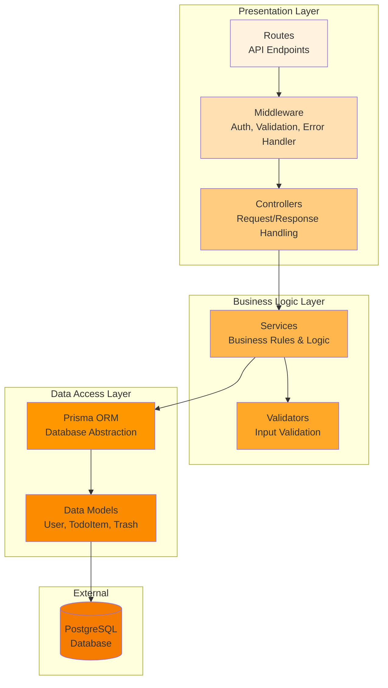
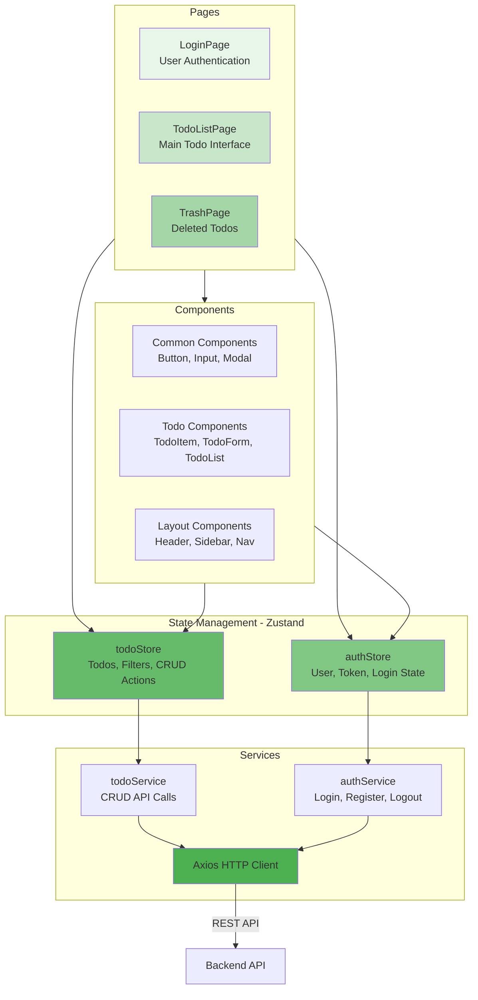
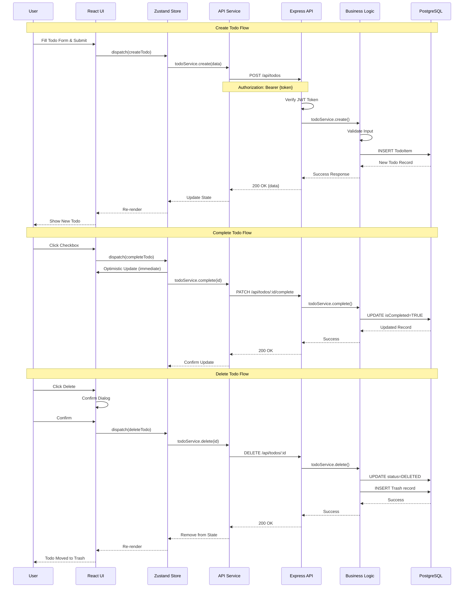
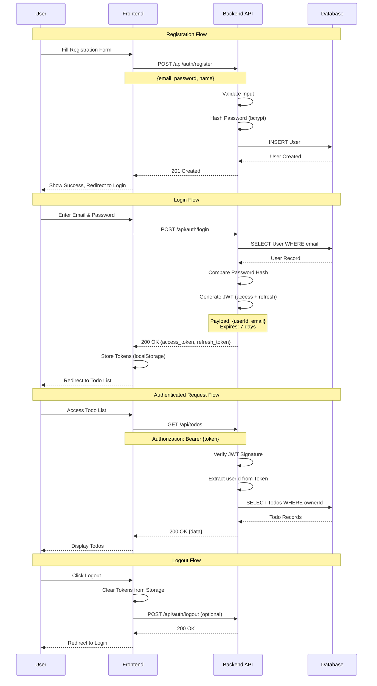
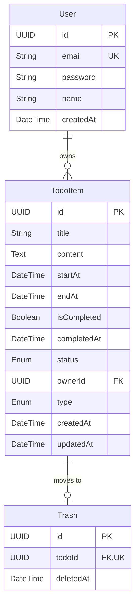

# IGK-TodoList Technical Architecture Diagram

## Document Information

- **Version**: 1.0
- **Last Updated**: 2025-11-26
- **Status**: Draft
- **Author**: Architect Reviewer
- **Related Documents**: [PRD](3-prd.md), [Domain Definition](1-domain-definition.md)

---

## Table of Contents

1. [Overview](#1-overview)
2. [System Architecture](#2-system-architecture)
3. [Backend Layer Architecture](#3-backend-layer-architecture)
4. [Frontend Architecture](#4-frontend-architecture)
5. [Data Flow](#5-data-flow)
6. [Authentication Flow](#6-authentication-flow)
7. [Database Schema](#7-database-schema)
8. [Deployment Architecture](#8-deployment-architecture)

---

## 1. Overview

This document provides technical architecture diagrams for the IGK-TodoList application. The architecture follows a simple layered pattern with clear separation between frontend, backend, and data layers.

### Key Architectural Principles

- **Simplicity First**: Keep architecture straightforward and maintainable
- **Layered Separation**: Clear boundaries between presentation, business logic, and data access
- **Stateless API**: RESTful API with JWT-based authentication
- **Scalability**: Serverless architecture for automatic scaling
- **Security**: Token-based authentication with encrypted passwords

---

## 2. System Architecture

### High-Level System Overview

This diagram shows the overall system architecture with user interaction, frontend, backend API, and database layers.



### Architecture Components

| Component | Technology | Purpose |
|-----------|-----------|---------|
| **Client** | Modern Browser | User interface access |
| **Frontend** | React 18, Zustand, Tailwind CSS | Single Page Application |
| **Backend API** | Node.js 20, Express 4 | RESTful API services |
| **Database** | PostgreSQL (Supabase) | Data persistence |
| **Deployment** | Vercel (Frontend + Backend Serverless) | Hosting and CDN |

---

## 3. Backend Layer Architecture

### Layered Architecture Pattern

The backend follows a clean layered architecture with separation of concerns.



### Layer Responsibilities

#### Presentation Layer
- **Routes**: Define API endpoints (auth, todos, trash)
- **Middleware**: Handle authentication, CORS, validation, error handling
- **Controllers**: Process HTTP requests/responses, delegate to services

#### Business Logic Layer
- **Services**: Implement core business logic (todo CRUD, authentication)
- **Validators**: Validate input data (express-validator)

#### Data Access Layer
- **Prisma ORM**: Database queries and transactions
- **Models**: Entity definitions (User, TodoItem, Trash)

---

## 4. Frontend Architecture

### Component-Based Architecture

The frontend uses React with a clear separation between UI components, state management, and API services.



### Frontend Structure

#### Pages Layer
- Route-level components (LoginPage, TodoListPage, TrashPage)
- Compose smaller components and manage page-level logic

#### Components Layer
- Reusable UI components (Button, Input, Modal)
- Feature-specific components (TodoItem, TodoForm)
- Layout components (Header, Sidebar)

#### State Management
- **authStore**: User authentication state, token, login/logout
- **todoStore**: Todo items, filters, CRUD operations

#### Services Layer
- API communication using Axios
- Centralized HTTP client configuration
- JWT token injection via interceptors

---

## 5. Data Flow

### Complete Todo CRUD Data Flow

This diagram shows how data flows through the system for typical todo operations.



---

## 6. Authentication Flow

### JWT-Based Authentication



### Security Measures

1. **Password Security**: bcrypt hashing with 10 rounds
2. **Token-Based Auth**: JWT with 7-day expiration
3. **HTTPS Only**: All communications encrypted
4. **Token Storage**: localStorage (with XSS protection via React)
5. **Account Lockout**: 5 failed attempts = 10-minute lock

---

## 7. Database Schema

### Entity Relationship Diagram



### Schema Details

#### User Table
- Primary authentication entity
- Stores hashed passwords (bcrypt)
- One-to-many relationship with TodoItems

#### TodoItem Table
- Main todo entity
- **status**: ACTIVE | DELETED
- **type**: PERSONAL | COMMON
- **ownerId**: NULL for common todos (national holidays)
- Soft delete pattern (status=DELETED)

#### Trash Table
- Tracks deleted todos for recovery
- One-to-one relationship with TodoItem
- Stores deletion timestamp

---

## 8. Deployment Architecture

### Serverless Deployment on Vercel

```mermaid
graph TB
    subgraph "User Devices"
        Browser[Web Browser]
        Mobile[Mobile Browser]
    end

    subgraph "Vercel CDN"
        CDN[Global CDN<br/>Static Assets<br/>React Build]
    end

    subgraph "Vercel Serverless Functions"
        F1[/api/auth/*<br/>Auth Functions]
        F2[/api/todos/*<br/>Todo Functions]
        F3[/api/trash/*<br/>Trash Functions]
    end

    subgraph "Supabase"
        PG[(PostgreSQL<br/>Primary Database)]
        Backup[(Auto Backup<br/>Daily)]
    end

    subgraph "External Services"
        GitHub[GitHub<br/>Source Control]
    end

    Browser --> CDN
    Mobile --> CDN

    Browser --> F1
    Browser --> F2
    Browser --> F3
    Mobile --> F1
    Mobile --> F2
    Mobile --> F3

    F1 --> PG
    F2 --> PG
    F3 --> PG

    PG --> Backup

    GitHub -->|Auto Deploy| CDN
    GitHub -->|Auto Deploy| F1
    GitHub -->|Auto Deploy| F2
    GitHub -->|Auto Deploy| F3

    style Browser fill:#fff3e0
    style Mobile fill:#fff3e0
    style CDN fill:#bbdefb
    style F1 fill:#90caf9
    style F2 fill:#90caf9
    style F3 fill:#90caf9
    style PG fill:#64b5f6
    style Backup fill:#42a5f5
    style GitHub fill:#e1f5ff
```

### Deployment Components

#### Frontend Deployment (Vercel)
- Static React build deployed to global CDN
- Automatic HTTPS/SSL certificates
- Environment-based configuration (production, staging)

#### Backend Deployment (Vercel Serverless Functions)
- Express API runs as serverless functions
- Automatic scaling based on traffic
- Cold start optimization (~500ms)

#### Database (Supabase)
- Managed PostgreSQL instance
- Automatic daily backups (30-day retention)
- Connection pooling for serverless compatibility

#### CI/CD Pipeline
- GitHub integration for automatic deployments
- Push to main branch triggers production deployment
- Preview deployments for pull requests

---

## Architecture Evaluation

### Strengths

1. **Simple & Clear**: Easy to understand layered architecture
2. **Scalable**: Serverless functions scale automatically
3. **Cost-Effective**: Free tier usage for MVP (Vercel + Supabase)
4. **Fast Development**: Modern stack with good DX (Vite, Prisma)
5. **Secure**: JWT authentication, password hashing, HTTPS

### Potential Concerns

1. **Cold Starts**: Serverless functions may have 500ms+ cold start
   - **Mitigation**: Acceptable for internal tool with 80 users

2. **Database Connection Pooling**: Serverless needs connection management
   - **Mitigation**: Supabase provides built-in pooling

3. **No Caching Layer**: Direct database queries for all requests
   - **Mitigation**: Not needed for MVP scale (80 users, ~50 todos each)
   - **Future**: Add Redis if DAU exceeds 200

4. **Single Region**: No multi-region deployment
   - **Mitigation**: Internal company tool, single location acceptable

### Recommendations

#### For MVP (Current)
- Architecture is appropriate for stated requirements
- Focus on feature completion over premature optimization
- Monitor performance metrics post-launch

#### For v1.0 (3-6 months)
- Add application-level caching for common todos (national holidays)
- Implement request rate limiting (60 req/min per user)
- Add monitoring with Sentry for error tracking

#### For v2.0 (6-12 months)
- Consider Redis caching layer if user base grows beyond 200
- Implement websocket support for real-time updates (if team features added)
- Add database read replicas if query latency increases

---

## Technology Stack Summary

### Frontend Stack
```
React 18.x          - UI framework
Zustand 4.x         - State management
Tailwind CSS 3.x    - Styling
Vite 5.x            - Build tool
Axios 1.x           - HTTP client
React Router 6.x    - Routing
React Hook Form 7.x - Form handling
date-fns 3.x        - Date utilities
```

### Backend Stack
```
Node.js 20.x LTS    - Runtime
Express 4.x         - Web framework
Prisma 5.x          - ORM
JWT (jsonwebtoken)  - Authentication
bcrypt 5.x          - Password hashing
express-validator   - Input validation
cors 2.x            - CORS handling
dotenv 16.x         - Environment config
```

### Infrastructure
```
Vercel              - Frontend & Backend hosting
Supabase            - PostgreSQL database
GitHub              - Version control
```

---

## Conclusion

The IGK-TodoList architecture follows proven patterns with appropriate technology choices for the stated requirements. The layered backend architecture provides clear separation of concerns, while the component-based frontend enables reusable and maintainable UI code.

The serverless deployment strategy minimizes operational overhead while providing automatic scaling. For the target scale (80 users, expanding to 150), this architecture is well-suited and cost-effective.

Key architectural decisions align with the product goals of simplicity, speed, and security. The use of modern frameworks (React, Express, Prisma) ensures good developer experience and maintainability.

**Status**: Ready for implementation

**Next Steps**:
1. Set up project repositories (frontend, backend)
2. Configure development environment
3. Initialize database schema with Prisma migrations
4. Implement authentication layer (highest priority)
5. Begin iterative feature development following PRD priorities

---

**Document End**
