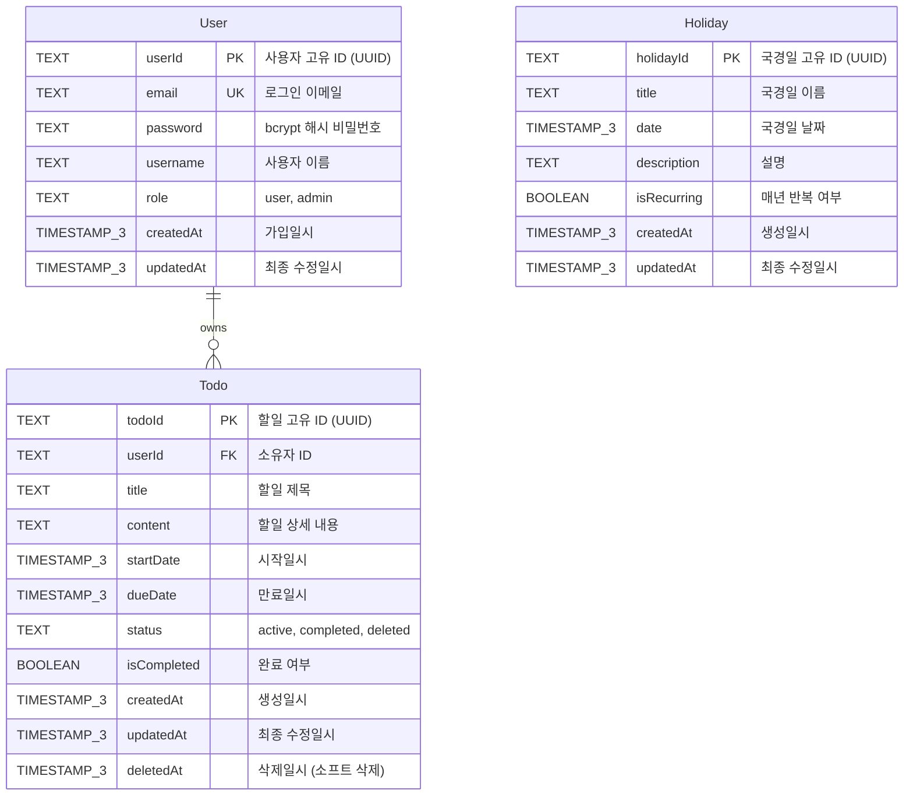

# igk-TodoList 데이터베이스 ERD

**버전**: 1.1
**작성일**: 2025-11-28 (v1.1 업데이트)
**상태**: 최종 (Prisma 스키마 반영)
**작성자**: Claude
**참조 문서**:

- [도메인 정의서](./1-domain-definition.md)
- [PRD](./3-prd.md)
- [Prisma 스키마](../backend/prisma/schema.prisma)

---

## 목차

1. [ERD 개요](#1-erd-개요)
2. [Mermaid ERD 다이어그램](#2-mermaid-erd-다이어그램)
3. [엔티티 상세 설명](#3-엔티티-상세-설명)
   - 3.1 [User (사용자)](#31-user-사용자)
   - 3.2 [Todo (할일)](#32-todo-할일)
   - 3.3 [Holiday (국경일)](#33-holiday-국경일)
4. [관계(Relationship) 설명](#4-관계relationship-설명)
5. [인덱스 전략](#5-인덱스-전략)
6. [제약 조건](#6-제약-조건)
7. [비즈니스 규칙 반영](#7-비즈니스-규칙-반영)
8. [소프트 삭제 패턴](#8-소프트-삭제-패턴)
9. [SQL DDL 예시](#9-sql-ddl-예시)

---

## 1. ERD 개요

### 1.1 데이터베이스 설계 목적

igk-TodoList 애플리케이션의 데이터 저장 및 관리를 위한 PostgreSQL 15+ 기반 데이터베이스 스키마입니다.

**중요**: 이 프로젝트는 **Prisma ORM**을 사용하여 데이터베이스를 관리합니다. 실제 스키마는 `backend/prisma/schema.prisma` 파일에서 정의되며, Prisma 마이그레이션을 통해 데이터베이스에 반영됩니다.

### 1.2 설계 원칙

1. **정규화**: 데이터 중복 최소화 및 무결성 보장
2. **확장성**: 향후 기능 추가를 고려한 유연한 구조
3. **성능**: 인덱싱을 통한 쿼리 최적화
4. **안전성**: 외래키 제약과 소프트 삭제를 통한 데이터 보호

### 1.3 주요 엔티티

- **User**: 사용자 계정 정보
- **Todo**: 사용자별 할일 정보
- **Holiday**: 공통 국경일 정보

### 1.4 데이터베이스 메타 정보

| 항목              | 내용                                        |
| ----------------- | ------------------------------------------- |
| DBMS              | PostgreSQL 15+                              |
| ORM               | Prisma 5.x                                  |
| 문자 인코딩       | UTF-8                                       |
| 타임존            | UTC                                         |
| 기본 ID 타입      | TEXT (UUID를 String으로 저장)               |
| 타임스탬프 정밀도 | TIMESTAMP(3) (밀리초 단위, WITHOUT TIMEZONE) |

---

## 2. Mermaid ERD 다이어그램



---

## 3. 엔티티 상세 설명

### 3.1 User (사용자)

사용자 계정 정보를 저장하는 테이블입니다.

#### 필드 정의

| 필드명    | 데이터 타입 (Prisma) | 데이터 타입 (PostgreSQL) | NULL | 기본값              | 제약 조건        | 설명                                     |
| --------- | -------------------- | ------------------------ | ---- | ------------------- | ---------------- | ---------------------------------------- |
| userId    | String               | TEXT                     | NO   | uuid()              | PRIMARY KEY      | 사용자 고유 식별자 (UUID)                |
| email     | String               | TEXT                     | NO   | -                   | UNIQUE, NOT NULL | 로그인용 이메일 주소                     |
| password  | String               | TEXT                     | NO   | -                   | NOT NULL         | bcrypt 해시된 비밀번호 (salt rounds: 10) |
| username  | String               | TEXT                     | NO   | -                   | NOT NULL         | 사용자 표시 이름                         |
| role      | String               | TEXT                     | NO   | 'user'              | NOT NULL         | 사용자 권한 역할 (user, admin)           |
| createdAt | DateTime             | TIMESTAMP(3)             | NO   | now()               | NOT NULL         | 계정 생성 일시 (UTC, 밀리초 포함)        |
| updatedAt | DateTime             | TIMESTAMP(3)             | NO   | @updatedAt (자동)   | NOT NULL         | 최종 정보 수정 일시 (UTC, 자동 갱신)     |

#### 비즈니스 규칙

- **BR-01**: 모든 API 접근은 인증된 사용자만 가능
- **BR-02**: 사용자는 자신의 할일만 조회/수정/삭제 가능
- 이메일은 중복 불가 (고유성 보장)
- 비밀번호는 bcrypt로 해싱하여 저장 (평문 저장 금지)
- role은 'user' 또는 'admin' 두 가지 값만 허용

#### 참고 사항

- Prisma의 `@default(uuid())` 사용으로 UUID 자동 생성
- PostgreSQL에서는 TEXT 타입으로 UUID 문자열 저장
- 이메일은 대소문자 구분 없이 저장 (소문자 변환 권장)
- updatedAt은 Prisma의 `@updatedAt` 속성으로 자동 갱신
- role은 TEXT 타입이지만 애플리케이션 레벨에서 'user' 또는 'admin'만 허용

---

### 3.2 Todo (할일)

사용자별 할일 정보를 저장하는 테이블입니다.

#### 필드 정의

| 필드명      | 데이터 타입 (Prisma) | 데이터 타입 (PostgreSQL) | NULL | 기본값            | 제약 조건                                                              | 설명                           |
| ----------- | -------------------- | ------------------------ | ---- | ----------------- | ---------------------------------------------------------------------- | ------------------------------ |
| todoId      | String               | TEXT                     | NO   | uuid()            | PRIMARY KEY                                                            | 할일 고유 식별자 (UUID)        |
| userId      | String               | TEXT                     | NO   | -                 | FOREIGN KEY REFERENCES User(userId) ON DELETE CASCADE ON UPDATE CASCADE | 할일 소유자 ID                 |
| title       | String               | TEXT                     | NO   | -                 | NOT NULL                                                               | 할일 제목                      |
| content     | String?              | TEXT                     | YES  | NULL              | -                                                                      | 할일 상세 내용 (선택사항)      |
| startDate   | DateTime?            | TIMESTAMP(3)             | YES  | NULL              | -                                                                      | 할일 시작일시                  |
| dueDate     | DateTime?            | TIMESTAMP(3)             | YES  | NULL              | -                                                                      | 할일 만료일시                  |
| status      | String               | TEXT                     | NO   | 'active'          | NOT NULL, DEFAULT 'active'                                             | 할일 상태 (active/completed/deleted) |
| isCompleted | Boolean              | BOOLEAN                  | NO   | false             | NOT NULL, DEFAULT false                                                | 완료 여부 플래그               |
| createdAt   | DateTime             | TIMESTAMP(3)             | NO   | now()             | NOT NULL                                                               | 할일 생성 일시 (UTC)           |
| updatedAt   | DateTime             | TIMESTAMP(3)             | NO   | @updatedAt (자동) | NOT NULL                                                               | 할일 최종 수정 일시 (UTC)      |
| deletedAt   | DateTime?            | TIMESTAMP(3)             | YES  | NULL              | -                                                                      | 할일 삭제 일시 (소프트 삭제용) |

#### 비즈니스 규칙

- **BR-02**: 사용자는 자신의 할일만 조회/수정/삭제 가능
- **BR-05**: 할일 삭제 시 휴지통으로 이동 (status='deleted', deletedAt 기록)
- **BR-06**: 휴지통의 할일은 복원 가능
- **BR-07**: 영구 삭제 시 DB에서 완전히 제거
- **BR-08**: 할일 완료 시 isCompleted=true, status='completed'
- **BR-12**: 만료일은 시작일과 같거나 이후여야 함
- **BR-13**: 만료일 지난 할일은 UI에서 시각적 구분

#### 상태 전이 규칙

```
[active] ──완료──> [completed]
         ──삭제──> [deleted]

[completed] ──삭제──> [deleted]
           ──미완료──> [active]

[deleted] ──복원──> [active]
         ──영구삭제──> [DB에서 제거]
```

#### 참고 사항

- title은 필수 입력 필드 (TEXT 타입으로 길이 제한 없음)
- content는 선택사항으로 NULL 허용 (Prisma의 `String?` 타입)
- **중요**: startDate와 dueDate는 DATE가 아닌 **TIMESTAMP(3)** 타입 (Prisma DateTime 매핑)
  - 시간 정보를 포함하지만 UI에서는 날짜만 표시 가능
- deletedAt은 소프트 삭제 시에만 값이 설정됨
- 사용자 삭제 시 해당 사용자의 모든 할일도 CASCADE로 삭제
- status는 TEXT 타입이지만 애플리케이션 레벨에서 'active', 'completed', 'deleted'만 허용
- **dueDate >= startDate 체크 제약조건은 Prisma 레벨에서는 구현되지 않음** (애플리케이션 레벨에서 검증 필요)

---

### 3.3 Holiday (국경일)

공통 국경일 정보를 저장하는 테이블입니다.

#### 필드 정의

| 필드명      | 데이터 타입 (Prisma) | 데이터 타입 (PostgreSQL) | NULL | 기본값            | 제약 조건   | 설명                               |
| ----------- | -------------------- | ------------------------ | ---- | ----------------- | ----------- | ---------------------------------- |
| holidayId   | String               | TEXT                     | NO   | uuid()            | PRIMARY KEY | 국경일 고유 식별자 (UUID)          |
| title       | String               | TEXT                     | NO   | -                 | NOT NULL    | 국경일 이름 (예: 신정, 설날)       |
| date        | DateTime             | TIMESTAMP(3)             | NO   | -                 | NOT NULL    | 국경일 날짜                        |
| description | String?              | TEXT                     | YES  | NULL              | -           | 국경일 설명                        |
| isRecurring | Boolean              | BOOLEAN                  | NO   | true              | NOT NULL    | 매년 반복 여부                     |
| createdAt   | DateTime             | TIMESTAMP(3)             | NO   | now()             | NOT NULL    | 국경일 데이터 생성 일시 (UTC)      |
| updatedAt   | DateTime             | TIMESTAMP(3)             | NO   | @updatedAt (자동) | NOT NULL    | 국경일 데이터 최종 수정 일시 (UTC) |

#### 비즈니스 규칙

- **BR-03**: 모든 인증된 사용자가 조회 가능
- **BR-04**: 관리자(role='admin')만 추가/수정 권한
- **BR-09**: 관리자만 추가/수정 가능
- **BR-10**: 국경일은 삭제 불가 (영구 보존)
- **BR-11**: 매년 반복되는 일정 지원

#### 데이터 예시

| holidayId | title      | date       | description          | isRecurring |
| --------- | ---------- | ---------- | -------------------- | ----------- |
| uuid-1    | 신정       | 2025-01-01 | 새해 첫날            | true        |
| uuid-2    | 설날       | 2025-01-29 | 음력 1월 1일         | true        |
| uuid-3    | 광복절     | 2025-08-15 | 대한민국 독립 기념일 | true        |
| uuid-4    | 크리스마스 | 2025-12-25 | 성탄절               | true        |

#### 참고 사항

- **중요**: date는 DATE가 아닌 **TIMESTAMP(3)** 타입 (Prisma DateTime 매핑)
  - 시간 정보를 포함하지만 UI에서는 날짜만 표시
- isRecurring=true인 경우 매년 같은 날짜에 표시
- 음력 기반 국경일(설날, 추석)은 연도별로 별도 레코드 생성 필요
- 국경일은 삭제 기능 없음 (관리자만 수정 가능)
- User 테이블과 관계 없음 (공통 데이터)

---

## 4. 관계(Relationship) 설명

### 4.1 User ↔ Todo (1:N)

**관계 유형**: One-to-Many (일대다)

**관계 설명**:

- 한 명의 사용자(User)는 여러 개의 할일(Todo)을 소유할 수 있습니다.
- 각 할일(Todo)은 반드시 한 명의 사용자에게 속합니다.

**외래키**: `Todo.userId` → `User.userId`

**CASCADE 규칙**:

```sql
ON DELETE CASCADE
```

- 사용자 삭제 시 해당 사용자의 모든 할일도 함께 삭제됩니다.
- 데이터 정합성을 보장합니다.

**참조 무결성**:

- Todo 생성 시 반드시 유효한 userId가 필요합니다.
- 존재하지 않는 userId로는 할일을 생성할 수 없습니다.

---

### 4.2 Holiday (독립 엔티티)

**관계 유형**: Independent (독립)

**관계 설명**:

- Holiday는 User 및 Todo와 직접적인 외래키 관계가 없습니다.
- 모든 사용자가 공통으로 조회하는 읽기 전용 데이터입니다.

**활용 방식**:

- 애플리케이션 레이어에서 할일 목록과 국경일을 함께 표시합니다.
- 날짜(date) 필드를 기준으로 조인하여 UI에서 병합합니다.

---

## 5. 인덱스 전략

**중요**: Prisma는 자동으로 다음 인덱스를 생성합니다:
- PRIMARY KEY에 대한 고유 인덱스
- `@unique` 속성이 있는 필드에 대한 고유 인덱스
- 외래키 필드에 대해서는 **자동으로 인덱스를 생성하지 않음**

### 5.1 User 테이블 인덱스

| 인덱스 이름     | 타입         | 컬럼   | 생성 방법          | 목적                      |
| --------------- | ------------ | ------ | ------------------ | ------------------------- |
| User_pkey       | PRIMARY KEY  | userId | Prisma 자동 생성   | 기본키 인덱스             |
| User_email_key  | UNIQUE INDEX | email  | Prisma @unique     | 로그인 시 빠른 조회       |

**쿼리 최적화 예시**:

```sql
-- 로그인 시 이메일 조회 (UNIQUE INDEX 활용)
SELECT * FROM "User" WHERE email = 'user@example.com';

-- 관리자 목록 조회 (INDEX 활용)
SELECT * FROM "User" WHERE role = 'admin';
```

---

### 5.2 Todo 테이블 인덱스

| 인덱스 이름 | 타입        | 컬럼   | 생성 방법        | 목적              |
| ----------- | ----------- | ------ | ---------------- | ----------------- |
| Todo_pkey   | PRIMARY KEY | todoId | Prisma 자동 생성 | 기본키 인덱스     |

**성능 최적화를 위한 추가 인덱스 권장** (Prisma 스키마에 `@@index` 추가 필요):
```prisma
model Todo {
  // ... 필드 정의

  @@index([userId, status])  // 사용자별 상태 조회 최적화
  @@index([dueDate])         // 만료일 기준 정렬 최적화
  @@index([deletedAt])       // 휴지통 조회 최적화
}
```

**복합 인덱스 설명**:

- `idx_todo_user_status`: userId와 status를 함께 조회하는 쿼리 최적화
  ```sql
  SELECT * FROM "Todo" WHERE userId = ? AND status = 'active';
  ```

**쿼리 최적화 예시**:

```sql
-- 활성 할일 조회 (복합 인덱스 활용)
SELECT * FROM "Todo"
WHERE userId = 'uuid' AND status = 'active'
ORDER BY dueDate ASC;

-- 휴지통 조회 (deletedAt 인덱스 활용)
SELECT * FROM "Todo"
WHERE userId = 'uuid' AND deletedAt IS NOT NULL
ORDER BY deletedAt DESC;

-- 만료 예정 할일 조회 (dueDate 인덱스 활용)
SELECT * FROM "Todo"
WHERE userId = 'uuid' AND dueDate <= CURRENT_DATE + INTERVAL '7 days'
ORDER BY dueDate ASC;
```

---

### 5.3 Holiday 테이블 인덱스

| 인덱스 이름  | 타입        | 컬럼      | 생성 방법        | 목적          |
| ------------ | ----------- | --------- | ---------------- | ------------- |
| Holiday_pkey | PRIMARY KEY | holidayId | Prisma 자동 생성 | 기본키 인덱스 |

**성능 최적화를 위한 추가 인덱스 권장**:
```prisma
model Holiday {
  // ... 필드 정의

  @@index([date])  // 날짜 기준 조회 최적화
}
```

**쿼리 최적화 예시**:

```sql
-- 특정 연도 국경일 조회 (date 인덱스 활용)
SELECT * FROM "Holiday"
WHERE EXTRACT(YEAR FROM date) = 2025
ORDER BY date ASC;

-- 특정 월 국경일 조회
SELECT * FROM "Holiday"
WHERE date >= '2025-01-01' AND date < '2025-02-01'
ORDER BY date ASC;
```

---

### 5.4 인덱스 관리 전략

**인덱스 생성 시점**:

- PRIMARY KEY, UNIQUE 제약은 테이블 생성 시 자동으로 인덱스 생성
- 일반 인덱스는 데이터 삽입 후 생성 (대량 데이터 INSERT 성능 향상)

**인덱스 모니터링**:

```sql
-- 인덱스 사용률 확인 (PostgreSQL)
SELECT
    schemaname, tablename, indexname, idx_scan, idx_tup_read
FROM pg_stat_user_indexes
WHERE schemaname = 'public'
ORDER BY idx_scan ASC;
```

**인덱스 재구성**:

```sql
-- 인덱스 재생성 (단편화 해소)
REINDEX TABLE "Todo";
```

---

## 6. 제약 조건

**중요**: Prisma는 선언적 스키마를 사용하며, 대부분의 제약 조건은 Prisma 스키마에서 정의됩니다.

### 6.1 기본키 제약 (Primary Key)

모든 테이블은 TEXT 타입으로 저장되는 UUID 기본키를 사용합니다.

```prisma
model User {
  userId String @id @default(uuid())
  // ...
}

model Todo {
  todoId String @id @default(uuid())
  // ...
}

model Holiday {
  holidayId String @id @default(uuid())
  // ...
}
```

**특징**:

- Prisma의 `@default(uuid())` 함수로 UUID 자동 생성
- PostgreSQL에서 TEXT 타입으로 저장 (Prisma String 매핑)
- 전역적 고유성 보장
- 자동 증가(AUTO_INCREMENT) 대비 보안성 향상

---

### 6.2 외래키 제약 (Foreign Key)

Prisma에서 외래키는 `@relation` 속성으로 정의됩니다:

```prisma
model Todo {
  todoId String @id @default(uuid())
  userId String
  user   User   @relation(fields: [userId], references: [userId], onDelete: Cascade)
  // ...
}

model User {
  userId String @id @default(uuid())
  todos  Todo[]
  // ...
}
```

**CASCADE 동작**:

- `onDelete: Cascade`: 사용자 삭제 시 해당 사용자의 모든 할일도 삭제
- Prisma는 기본적으로 `ON UPDATE CASCADE`를 설정
- PostgreSQL 외래키 제약조건명: `Todo_userId_fkey`

---

### 6.3 고유성 제약 (Unique)

Prisma에서 고유성 제약은 `@unique` 속성으로 정의됩니다:

```prisma
model User {
  userId String @id @default(uuid())
  email  String @unique
  // ...
}
```

**목적**:

- 이메일 중복 가입 방지
- 로그인 시 고유성 보장
- PostgreSQL 제약조건명: `User_email_key`

---

### 6.4 NOT NULL 제약

| 테이블  | 필수 필드                                                        |
| ------- | ---------------------------------------------------------------- |
| User    | userId, email, password, username, role, createdAt, updatedAt    |
| Todo    | todoId, userId, title, status, isCompleted, createdAt, updatedAt |
| Holiday | holidayId, title, date, isRecurring, createdAt, updatedAt        |

---

### 6.5 체크 제약 (Check Constraint)

**중요**: Prisma는 현재 데이터베이스 레벨의 CHECK 제약조건을 직접 지원하지 않습니다.
대신 애플리케이션 레벨에서 검증을 수행해야 합니다.

#### 6.5.1 Todo.dueDate 검증 (애플리케이션 레벨)

**규칙**: 만료일은 시작일과 같거나 이후여야 함 (BR-12)

```typescript
// 애플리케이션 코드에서 검증
if (dueDate && startDate && dueDate < startDate) {
  throw new Error('만료일은 시작일 이후여야 합니다');
}
```

**허용 사례**:
- startDate='2025-11-25', dueDate='2025-11-28' ✅
- startDate='2025-11-25', dueDate='2025-11-25' ✅
- startDate=NULL, dueDate='2025-11-28' ✅
- startDate='2025-11-25', dueDate=NULL ✅

**거부 사례**:
- startDate='2025-11-25', dueDate='2025-11-24' ❌

#### 6.5.2 User.role 검증 (애플리케이션 레벨)

**규칙**: role은 'user' 또는 'admin'만 허용

```typescript
// TypeScript enum 또는 Zod 스키마로 검증
enum UserRole {
  USER = 'user',
  ADMIN = 'admin'
}
```

#### 6.5.3 Todo.status 검증 (애플리케이션 레벨)

**규칙**: status는 'active', 'completed', 'deleted'만 허용

```typescript
enum TodoStatus {
  ACTIVE = 'active',
  COMPLETED = 'completed',
  DELETED = 'deleted'
}
```

---

### 6.6 기본값 제약 (Default)

Prisma에서 기본값은 `@default()` 속성으로 정의됩니다:

| 테이블  | 필드        | Prisma 기본값      | 설명                       |
| ------- | ----------- | ------------------ | -------------------------- |
| User    | userId      | @default(uuid())   | UUID 자동 생성             |
| User    | role        | @default("user")   | 일반 사용자 역할           |
| User    | createdAt   | @default(now())    | 현재 시각                  |
| User    | updatedAt   | @updatedAt         | 자동 갱신 (수정 시마다)    |
| Todo    | todoId      | @default(uuid())   | UUID 자동 생성             |
| Todo    | status      | @default("active") | 활성 상태                  |
| Todo    | isCompleted | @default(false)    | 미완료 상태                |
| Todo    | createdAt   | @default(now())    | 현재 시각                  |
| Todo    | updatedAt   | @updatedAt         | 자동 갱신                  |
| Holiday | holidayId   | @default(uuid())   | UUID 자동 생성             |
| Holiday | isRecurring | @default(true)     | 매년 반복                  |
| Holiday | createdAt   | @default(now())    | 현재 시각                  |
| Holiday | updatedAt   | @updatedAt         | 자동 갱신                  |

**특징**:
- `@updatedAt`: Prisma가 자동으로 수정 시각 갱신 (트리거 불필요)

---

## 7. 비즈니스 규칙 반영

### 7.1 인증 및 권한 (Authentication & Authorization)

| 규칙 ID | 내용                                       | 구현 방법                           |
| ------- | ------------------------------------------ | ----------------------------------- |
| BR-01   | 인증된 사용자만 접근 가능                  | JWT 토큰 검증 (애플리케이션 레이어) |
| BR-02   | 사용자는 자신의 할일만 조회/수정/삭제 가능 | WHERE userId = 현재\_사용자\_ID     |
| BR-04   | 관리자만 국경일 추가/수정 권한             | WHERE role = 'admin'                |
| BR-09   | 관리자만 국경일 추가/수정 가능             | WHERE role = 'admin'                |

---

### 7.2 할일 관리 규칙

| 규칙 ID | 내용                                              | 구현 방법                                          |
| ------- | ------------------------------------------------- | -------------------------------------------------- |
| BR-05   | 할일 삭제 시 휴지통으로 이동                      | UPDATE status='deleted', deletedAt=NOW()           |
| BR-06   | 휴지통의 할일은 복원 가능                         | UPDATE status='active', deletedAt=NULL             |
| BR-07   | 영구 삭제 시 DB에서 완전히 제거                   | DELETE FROM "Todo" WHERE todoId=?                  |
| BR-08   | 할일 완료 시 isCompleted=true, status='completed' | UPDATE isCompleted=true, status='completed'        |
| BR-12   | 만료일은 시작일과 같거나 이후여야 함              | CHECK (dueDate >= startDate)                       |
| BR-13   | 만료일 지난 할일은 UI에서 시각적 구분             | WHERE dueDate < CURRENT_DATE (애플리케이션 레이어) |

---

### 7.3 국경일 관리 규칙

| 규칙 ID | 내용                         | 구현 방법                          |
| ------- | ---------------------------- | ---------------------------------- |
| BR-03   | 모든 인증된 사용자 조회 가능 | WHERE절 없이 전체 조회 허용        |
| BR-10   | 국경일은 삭제 불가           | DELETE 기능 미구현 (관리자도 불가) |
| BR-11   | 매년 반복되는 일정 지원      | isRecurring 필드로 플래그 관리     |

---

## 8. 소프트 삭제 패턴

### 8.1 소프트 삭제란?

데이터를 물리적으로 삭제하지 않고 논리적으로만 삭제 상태로 표시하는 방식입니다.

**장점**:

- 실수로 삭제한 데이터 복구 가능
- 데이터 변경 이력 추적 가능
- 외래키 참조 무결성 유지

**단점**:

- 스토리지 사용량 증가
- 쿼리 시 deletedAt 조건 추가 필요
- 인덱스 효율성 저하 가능성

---

### 8.2 Todo 테이블의 소프트 삭제 구현

#### 8.2.1 데이터 구조

```sql
-- 삭제 관련 필드
status      ENUM('active', 'completed', 'deleted')
deletedAt   TIMESTAMP NULL
```

#### 8.2.2 삭제 동작

**일반 삭제 (휴지통 이동)**:

```sql
UPDATE "Todo"
SET
    status = 'deleted',
    deletedAt = NOW(),
    updatedAt = NOW()
WHERE todoId = ? AND userId = ?;
```

**영구 삭제**:

```sql
DELETE FROM "Todo"
WHERE todoId = ? AND userId = ? AND status = 'deleted';
```

#### 8.2.3 복원 동작

```sql
UPDATE "Todo"
SET
    status = 'active',
    deletedAt = NULL,
    updatedAt = NOW()
WHERE todoId = ? AND userId = ? AND status = 'deleted';
```

#### 8.2.4 조회 쿼리 패턴

**활성 할일만 조회**:

```sql
SELECT * FROM "Todo"
WHERE userId = ? AND status IN ('active', 'completed')
ORDER BY createdAt DESC;
```

**휴지통 조회**:

```sql
SELECT * FROM "Todo"
WHERE userId = ? AND status = 'deleted'
ORDER BY deletedAt DESC;
```

**전체 조회 (관리 목적)**:

```sql
SELECT * FROM "Todo"
WHERE userId = ?
ORDER BY createdAt DESC;
```

---

### 8.3 소프트 삭제 주의사항

1. **인덱스 전략**: deletedAt 컬럼에 인덱스 생성 필요
2. **쿼리 성능**: 모든 SELECT 쿼리에 status 조건 추가 필수
3. **데이터 정리**: 주기적으로 오래된 삭제 데이터 정리 (예: 30일 이상 경과)
4. **용량 관리**: 삭제된 데이터가 누적되면 테이블 크기 증가

---

## 9. Prisma 스키마 정의

### 9.1 Prisma 스키마 파일 (`backend/prisma/schema.prisma`)

**중요**: 이 프로젝트는 SQL DDL 대신 Prisma 스키마를 사용합니다.
스키마 변경 시 `npx prisma migrate dev` 명령으로 마이그레이션을 생성하고 적용합니다.

#### 9.1.1 User 모델

```prisma
model User {
  userId    String   @id @default(uuid())
  email     String   @unique
  password  String
  username  String
  role      String   @default("user")
  createdAt DateTime @default(now())
  updatedAt DateTime @updatedAt
  todos     Todo[]
}
```

**생성되는 PostgreSQL 테이블**:
- userId: TEXT PRIMARY KEY
- email: TEXT UNIQUE
- password: TEXT
- username: TEXT
- role: TEXT DEFAULT 'user'
- createdAt: TIMESTAMP(3) DEFAULT CURRENT_TIMESTAMP
- updatedAt: TIMESTAMP(3) (자동 갱신)

#### 9.1.2 Todo 모델

```prisma
model Todo {
  todoId      String    @id @default(uuid())
  userId      String
  user        User      @relation(fields: [userId], references: [userId], onDelete: Cascade)
  title       String
  content     String?
  startDate   DateTime?
  dueDate     DateTime?
  status      String    @default("active")
  isCompleted Boolean   @default(false)
  createdAt   DateTime  @default(now())
  updatedAt   DateTime  @updatedAt
  deletedAt   DateTime?
}
```

**생성되는 PostgreSQL 테이블**:
- todoId: TEXT PRIMARY KEY
- userId: TEXT (외래키)
- title: TEXT
- content: TEXT NULL
- startDate: TIMESTAMP(3) NULL
- dueDate: TIMESTAMP(3) NULL
- status: TEXT DEFAULT 'active'
- isCompleted: BOOLEAN DEFAULT false
- createdAt: TIMESTAMP(3) DEFAULT CURRENT_TIMESTAMP
- updatedAt: TIMESTAMP(3) (자동 갱신)
- deletedAt: TIMESTAMP(3) NULL

**주의사항**:
- dueDate >= startDate 검증은 애플리케이션 레벨에서 수행 필요
- 성능 최적화를 위해 인덱스 추가 권장 (`@@index([userId, status])`)

#### 9.1.3 Holiday 모델

```prisma
model Holiday {
  holidayId   String   @id @default(uuid())
  title       String
  date        DateTime
  description String?
  isRecurring Boolean  @default(true)
  createdAt   DateTime @default(now())
  updatedAt   DateTime @updatedAt
}
```

**생성되는 PostgreSQL 테이블**:
- holidayId: TEXT PRIMARY KEY
- title: TEXT
- date: TIMESTAMP(3)
- description: TEXT NULL
- isRecurring: BOOLEAN DEFAULT true
- createdAt: TIMESTAMP(3) DEFAULT CURRENT_TIMESTAMP
- updatedAt: TIMESTAMP(3) (자동 갱신)

---

### 9.2 Prisma 마이그레이션 워크플로우

Prisma는 트리거 대신 `@updatedAt` 속성을 사용하여 자동으로 updatedAt을 갱신합니다.

#### 마이그레이션 생성 및 적용

```bash
# 1. Prisma 스키마 수정 후 마이그레이션 생성
npx prisma migrate dev --name add_user_table

# 2. 프로덕션 환경에서 마이그레이션 적용
npx prisma migrate deploy

# 3. Prisma Client 재생성
npx prisma generate

# 4. 데이터베이스 스키마와 Prisma 스키마 동기화 확인
npx prisma db pull  # DB → Prisma 스키마
npx prisma db push  # Prisma 스키마 → DB (개발 시에만 사용)
```

#### 마이그레이션 파일 예시

Prisma는 `prisma/migrations/` 디렉토리에 SQL 마이그레이션 파일을 자동 생성합니다:

```
prisma/migrations/
├── 20251128000001_init/
│   └── migration.sql
├── 20251128000002_add_indexes/
│   └── migration.sql
└── migration_lock.toml
```

---

### 9.3 초기 데이터 삽입 (Prisma Seed)

Prisma는 `prisma/seed.ts` 파일을 통해 시드 데이터를 삽입합니다.

#### 9.3.1 관리자 계정 생성

```typescript
// prisma/seed.ts
import { PrismaClient } from '@prisma/client';
import bcrypt from 'bcrypt';

const prisma = new PrismaClient();

async function main() {
  // 관리자 계정 생성
  const hashedPassword = await bcrypt.hash('admin123', 10);

  await prisma.user.upsert({
    where: { email: 'admin@igk-todolist.com' },
    update: {},
    create: {
      email: 'admin@igk-todolist.com',
      password: hashedPassword,
      username: '관리자',
      role: 'admin',
    },
  });

  console.log('관리자 계정 생성 완료');
}

main()
  .catch((e) => {
    console.error(e);
    process.exit(1);
  })
  .finally(async () => {
    await prisma.$disconnect();
  });
```

```bash
# 시드 실행
npx prisma db seed
```

#### 9.3.2 국경일 데이터 삽입

```typescript
// prisma/seed.ts에 추가
const holidays = [
  { title: '신정', date: new Date('2025-01-01'), description: '새해 첫날', isRecurring: true },
  { title: '설날', date: new Date('2025-01-29'), description: '음력 1월 1일 (설)', isRecurring: true },
  { title: '삼일절', date: new Date('2025-03-01'), description: '3·1운동 기념일', isRecurring: true },
  { title: '어린이날', date: new Date('2025-05-05'), description: '어린이날', isRecurring: true },
  { title: '석가탄신일', date: new Date('2025-05-05'), description: '부처님 오신 날', isRecurring: true },
  { title: '현충일', date: new Date('2025-06-06'), description: '호국영령 추념일', isRecurring: true },
  { title: '광복절', date: new Date('2025-08-15'), description: '대한민국 독립 기념일', isRecurring: true },
  { title: '추석', date: new Date('2025-10-06'), description: '음력 8월 15일 (추석)', isRecurring: true },
  { title: '개천절', date: new Date('2025-10-03'), description: '단군 건국 기념일', isRecurring: true },
  { title: '한글날', date: new Date('2025-10-09'), description: '한글 창제 기념일', isRecurring: true },
  { title: '크리스마스', date: new Date('2025-12-25'), description: '성탄절', isRecurring: true },
];

for (const holiday of holidays) {
  await prisma.holiday.upsert({
    where: {
      // holidayId는 고유하므로 title과 date 조합으로 중복 확인
      title_date: { title: holiday.title, date: holiday.date }
    },
    update: {},
    create: holiday,
  });
}

console.log('국경일 데이터 삽입 완료');
```

---

### 9.4 데이터 조회 쿼리 예시

#### 9.4.1 사용자별 활성 할일 조회

```sql
SELECT
    t.todoId,
    t.title,
    t.content,
    t.startDate,
    t.dueDate,
    t.status,
    t.isCompleted,
    t.createdAt,
    t.updatedAt,
    CASE
        WHEN t.dueDate < CURRENT_DATE THEN true
        ELSE false
    END AS isOverdue
FROM "Todo" t
WHERE t.userId = '사용자_UUID'
  AND t.status IN ('active', 'completed')
ORDER BY
    t.isCompleted ASC,
    t.dueDate ASC NULLS LAST,
    t.createdAt DESC;
```

#### 9.4.2 월별 할일 및 국경일 통합 조회

```sql
-- 2025년 11월 할일 및 국경일
WITH monthly_data AS (
    -- 할일
    SELECT
        todoId AS id,
        'todo' AS type,
        title,
        startDate AS date,
        dueDate,
        status,
        isCompleted
    FROM "Todo"
    WHERE userId = '사용자_UUID'
      AND status IN ('active', 'completed')
      AND (
          (startDate >= '2025-11-01' AND startDate < '2025-12-01')
          OR (dueDate >= '2025-11-01' AND dueDate < '2025-12-01')
      )

    UNION ALL

    -- 국경일
    SELECT
        holidayId AS id,
        'holiday' AS type,
        title,
        date,
        NULL AS dueDate,
        NULL AS status,
        NULL AS isCompleted
    FROM "Holiday"
    WHERE date >= '2025-11-01' AND date < '2025-12-01'
)
SELECT * FROM monthly_data
ORDER BY date ASC, type DESC;
```

#### 9.4.3 휴지통 조회 (30일 이내 삭제)

```sql
SELECT
    todoId,
    title,
    deletedAt,
    EXTRACT(DAY FROM (NOW() - deletedAt)) AS days_in_trash
FROM "Todo"
WHERE userId = '사용자_UUID'
  AND status = 'deleted'
  AND deletedAt > NOW() - INTERVAL '30 days'
ORDER BY deletedAt DESC;
```

---

### 9.5 데이터베이스 초기화

Prisma를 사용하는 경우 다음 명령으로 데이터베이스를 초기화할 수 있습니다:

```bash
# 모든 마이그레이션 되돌리기 및 데이터 삭제
npx prisma migrate reset

# 또는 수동으로 테이블 삭제 (PostgreSQL)
DROP TABLE IF EXISTS "_prisma_migrations" CASCADE;
DROP TABLE IF EXISTS "Todo" CASCADE;
DROP TABLE IF EXISTS "User" CASCADE;
DROP TABLE IF EXISTS "Holiday" CASCADE;
```

---

## 부록

### A. ERD 버전 관리

| 버전 | 날짜       | 변경 내용                                      | 작성자 |
| ---- | ---------- | ---------------------------------------------- | ------ |
| 1.0  | 2025-11-26 | 초안 작성 및 최종                              | Claude |
| 1.1  | 2025-11-28 | Prisma 스키마 반영, 실제 DB 구조와 동기화 | Claude |

**v1.1 주요 변경사항**:
- UUID → TEXT 타입 변경 (Prisma String 매핑)
- VARCHAR(n) → TEXT 변경 (Prisma 기본 매핑)
- DATE → TIMESTAMP(3) 변경 (startDate, dueDate, Holiday.date)
- ENUM → TEXT 변경 (애플리케이션 레벨 검증)
- SQL DDL → Prisma 스키마 정의로 변경
- 트리거 → @updatedAt 속성으로 변경
- Holiday.isRecurring 기본값 true로 수정

---

### B. Prisma 마이그레이션 전략

**초기 구축** (Prisma 사용):

1. `prisma/schema.prisma` 파일 작성
2. `npx prisma migrate dev --name init` 실행
3. Prisma가 자동으로 테이블, 인덱스, 외래키 생성
4. `npx prisma db seed` 실행하여 초기 데이터 삽입

**스키마 변경 시**:

1. `prisma/schema.prisma` 수정
2. `npx prisma migrate dev --name <변경_설명>` 실행
3. Prisma가 자동으로 마이그레이션 SQL 생성 및 적용
4. 필요시 `prisma/migrations/` 디렉토리에서 SQL 확인 및 수정

**프로덕션 배포**:

```bash
npx prisma migrate deploy  # 프로덕션 DB에 마이그레이션 적용
npx prisma generate        # Prisma Client 재생성
```

**롤백**:

Prisma는 자동 롤백을 지원하지 않으므로, 수동으로 이전 마이그레이션 상태로 복구하거나 데이터베이스 백업을 사용해야 합니다.

---

### C. 참조 문서

- [Prisma 공식 문서](https://www.prisma.io/docs)
- [Prisma Schema Reference](https://www.prisma.io/docs/reference/api-reference/prisma-schema-reference)
- [Prisma Migrate](https://www.prisma.io/docs/concepts/components/prisma-migrate)
- [PostgreSQL 15 공식 문서](https://www.postgresql.org/docs/15/)
- [Prisma와 PostgreSQL 타입 매핑](https://www.prisma.io/docs/reference/database-reference/database-features#postgresql)

---

**문서 종료**
