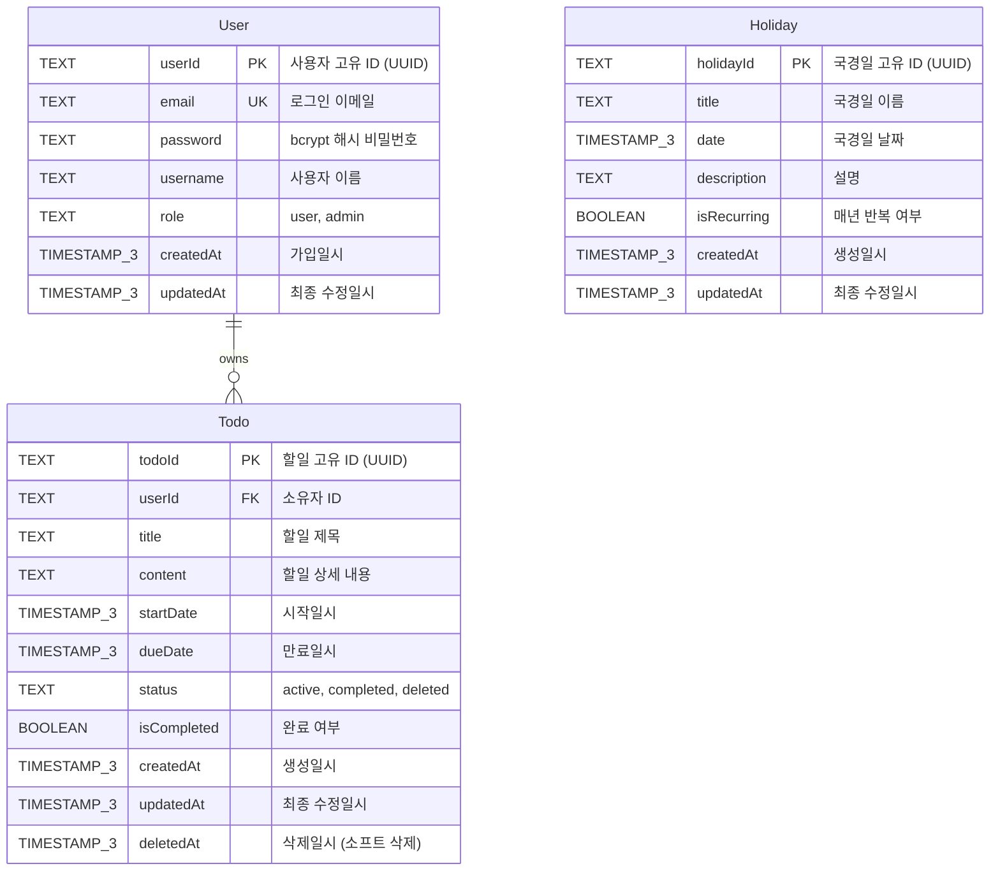

# igk-TodoList 데이터베이스 ERD

**버전**: 1.2
**작성일**: 2025-11-28 (v1.2 업데이트 - pg 라이브러리 마이그레이션)
**상태**: 최종 (pg 라이브러리 사용)
**작성자**: Claude
**참조 문서**:

- [도메인 정의서](./1-domain-definition.md)
- [PRD](./3-prd.md)
- [스키마 파일](../database/schema.sql)

---

## 목차

1. [ERD 개요](#1-erd-개요)
2. [Mermaid ERD 다이어그램](#2-mermaid-erd-다이어그램)
3. [엔티티 상세 설명](#3-엔티티-상세-설명)
   - 3.1 [User (사용자)](#31-user-사용자)
   - 3.2 [Todo (할일)](#32-todo-할일)
   - 3.3 [Holiday (국경일)](#33-holiday-국경일)
4. [관계(Relationship) 설명](#4-관계relationship-설명)
5. [인덱스 전략](#5-인덱스-전략)
6. [제약 조건](#6-제약-조건)
7. [비즈니스 규칙 반영](#7-비즈니스-규칙-반영)
8. [소프트 삭제 패턴](#8-소프트-삭제-패턴)
9. [데이터베이스 접근 계층](#9-데이터베이스-접근-계층)

---

## 1. ERD 개요

### 1.1 데이터베이스 설계 목적

igk-TodoList 애플리케이션의 데이터 저장 및 관리를 위한 PostgreSQL 15+ 기반 데이터베이스 스키마입니다.

**중요**: 이 프로젝트는 **pg 라이브러리**를 사용하여 PostgreSQL 데이터베이스에 직접 접근합니다. Repository 패턴과 Clean Architecture를 적용하여 데이터 접근 계층을 구현했습니다.

### 1.2 설계 원칙

1. **정규화**: 데이터 중복 최소화 및 무결성 보장
2. **확장성**: 향후 기능 추가를 고려한 유연한 구조
3. **성능**: 인덱싱을 통한 쿼리 최적화
4. **안전성**: 외래키 제약과 소프트 삭제를 통한 데이터 보호
5. **Clean Architecture**: Repository 패턴으로 데이터 접근 계층 분리

### 1.3 주요 엔티티

- **User**: 사용자 계정 정보
- **Todo**: 사용자별 할일 정보
- **Holiday**: 공통 국경일 정보

### 1.4 데이터베이스 메타 정보

| 항목              | 내용                                        |
| ----------------- | ------------------------------------------- |
| DBMS              | PostgreSQL 15+                              |
| Database Library  | pg 8.x (node-postgres)                      |
| Architecture      | Clean Architecture + Repository Pattern     |
| 문자 인코딩       | UTF-8                                       |
| 타임존            | UTC                                         |
| 기본 ID 타입      | TEXT (UUID)                                 |
| 타임스탬프 정밀도 | TIMESTAMP(3) (밀리초 단위, WITHOUT TIMEZONE) |

---

## 2. Mermaid ERD 다이어그램



---

## 3. 엔티티 상세 설명

### 3.1 User (사용자)

사용자 계정 정보를 저장하는 테이블입니다.

#### 필드 정의

| 필드명    | 데이터 타입      | NULL | 기본값            | 제약 조건        | 설명                                     |
| --------- | ---------------- | ---- | ----------------- | ---------------- | ---------------------------------------- |
| userId    | TEXT             | NO   | -                 | PRIMARY KEY      | 사용자 고유 식별자 (UUID, 애플리케이션에서 생성) |
| email     | TEXT             | NO   | -                 | UNIQUE, NOT NULL | 로그인용 이메일 주소                     |
| password  | TEXT             | NO   | -                 | NOT NULL         | bcrypt 해시된 비밀번호 (salt rounds: 10) |
| username  | TEXT             | NO   | -                 | NOT NULL         | 사용자 표시 이름                         |
| role      | TEXT             | NO   | 'user'            | NOT NULL         | 사용자 권한 역할 (user, admin)           |
| createdAt | TIMESTAMP(3)     | NO   | CURRENT_TIMESTAMP | NOT NULL         | 계정 생성 일시 (UTC, 밀리초 포함)        |
| updatedAt | TIMESTAMP(3)     | NO   | CURRENT_TIMESTAMP | NOT NULL         | 최종 정보 수정 일시 (UTC)                |

#### 비즈니스 규칙

- **BR-01**: 모든 API 접근은 인증된 사용자만 가능
- **BR-02**: 사용자는 자신의 할일만 조회/수정/삭제 가능
- 이메일은 중복 불가 (고유성 보장)
- 비밀번호는 bcrypt로 해싱하여 저장 (평문 저장 금지)
- role은 'user' 또는 'admin' 두 가지 값만 허용 (애플리케이션 레벨 검증)

#### 참고 사항

- userId는 애플리케이션(JavaScript `uuid` 라이브러리)에서 생성
- PostgreSQL TEXT 타입으로 UUID 문자열 저장
- 이메일은 대소문자 구분 없이 저장 (소문자 변환 권장)
- updatedAt은 Repository에서 수동으로 갱신 (`CURRENT_TIMESTAMP` 사용)
- role 검증은 Service 레이어에서 수행

---

### 3.2 Todo (할일)

사용자별 할일 정보를 저장하는 테이블입니다.

#### 필드 정의

| 필드명      | 데이터 타입  | NULL | 기본값            | 제약 조건                                                              | 설명                                 |
| ----------- | ------------ | ---- | ----------------- | ---------------------------------------------------------------------- | ------------------------------------ |
| todoId      | TEXT         | NO   | -                 | PRIMARY KEY                                                            | 할일 고유 식별자 (UUID, 애플리케이션에서 생성) |
| userId      | TEXT         | NO   | -                 | FOREIGN KEY REFERENCES User(userId) ON DELETE CASCADE ON UPDATE CASCADE | 할일 소유자 ID                       |
| title       | TEXT         | NO   | -                 | NOT NULL                                                               | 할일 제목                            |
| content     | TEXT         | YES  | NULL              | -                                                                      | 할일 상세 내용 (선택사항)            |
| startDate   | TIMESTAMP(3) | YES  | NULL              | -                                                                      | 할일 시작일시                        |
| dueDate     | TIMESTAMP(3) | YES  | NULL              | -                                                                      | 할일 만료일시                        |
| status      | TEXT         | NO   | 'active'          | NOT NULL, DEFAULT 'active'                                             | 할일 상태 (active/completed/deleted) |
| isCompleted | BOOLEAN      | NO   | false             | NOT NULL, DEFAULT false                                                | 완료 여부 플래그                     |
| createdAt   | TIMESTAMP(3) | NO   | CURRENT_TIMESTAMP | NOT NULL                                                               | 할일 생성 일시 (UTC)                 |
| updatedAt   | TIMESTAMP(3) | NO   | CURRENT_TIMESTAMP | NOT NULL                                                               | 할일 최종 수정 일시 (UTC)            |
| deletedAt   | TIMESTAMP(3) | YES  | NULL              | -                                                                      | 할일 삭제 일시 (소프트 삭제용)       |

#### 비즈니스 규칙

- **BR-02**: 사용자는 자신의 할일만 조회/수정/삭제 가능
- **BR-05**: 할일 삭제 시 휴지통으로 이동 (status='deleted', deletedAt 기록)
- **BR-06**: 휴지통의 할일은 복원 가능
- **BR-07**: 영구 삭제 시 DB에서 완전히 제거
- **BR-08**: 할일 완료 시 isCompleted=true, status='completed'
- **BR-12**: 만료일은 시작일과 같거나 이후여야 함 (Service 레이어에서 검증)
- **BR-13**: 만료일 지난 할일은 UI에서 시각적 구분

#### 상태 전이 규칙

```
[active] ──완료──> [completed]
         ──삭제──> [deleted]

[completed] ──삭제──> [deleted]
           ──미완료──> [active]

[deleted] ──복원──> [active]
         ──영구삭제──> [DB에서 제거]
```

#### 참고 사항

- title은 필수 입력 필드
- content는 선택사항으로 NULL 허용
- startDate와 dueDate는 TIMESTAMP(3) 타입 (시간 정보 포함, UI에서는 날짜만 표시 가능)
- deletedAt은 소프트 삭제 시에만 값이 설정됨
- 사용자 삭제 시 해당 사용자의 모든 할일도 CASCADE로 삭제
- status 값은 애플리케이션 레벨에서 'active', 'completed', 'deleted'만 허용
- dueDate >= startDate 검증은 Service 레이어에서 수행

---

### 3.3 Holiday (국경일)

공통 국경일 정보를 저장하는 테이블입니다.

#### 필드 정의

| 필드명      | 데이터 타입  | NULL | 기본값            | 제약 조건   | 설명                          |
| ----------- | ------------ | ---- | ----------------- | ----------- | ----------------------------- |
| holidayId   | TEXT         | NO   | -                 | PRIMARY KEY | 국경일 고유 식별자 (UUID, 애플리케이션에서 생성) |
| title       | TEXT         | NO   | -                 | NOT NULL    | 국경일 이름 (예: 신정, 설날)  |
| date        | TIMESTAMP(3) | NO   | -                 | NOT NULL    | 국경일 날짜                   |
| description | TEXT         | YES  | NULL              | -           | 국경일 설명                   |
| isRecurring | BOOLEAN      | NO   | true              | NOT NULL    | 매년 반복 여부                |
| createdAt   | TIMESTAMP(3) | NO   | CURRENT_TIMESTAMP | NOT NULL    | 국경일 데이터 생성 일시 (UTC) |
| updatedAt   | TIMESTAMP(3) | NO   | CURRENT_TIMESTAMP | NOT NULL    | 국경일 데이터 최종 수정 일시 (UTC) |

#### 비즈니스 규칙

- **BR-03**: 모든 인증된 사용자가 조회 가능
- **BR-04**: 관리자(role='admin')만 추가/수정 권한
- **BR-09**: 관리자만 추가/수정 가능
- **BR-10**: 국경일은 삭제 불가 (영구 보존)
- **BR-11**: 매년 반복되는 일정 지원

#### 참고 사항

- date는 TIMESTAMP(3) 타입 (시간 정보 포함, UI에서는 날짜만 표시)
- isRecurring=true인 경우 매년 같은 날짜에 표시
- 음력 기반 국경일(설날, 추석)은 연도별로 별도 레코드 생성 필요
- 국경일은 삭제 기능 없음 (관리자만 수정 가능)
- User 테이블과 관계 없음 (공통 데이터)

---

## 4. 관계(Relationship) 설명

### 4.1 User ↔ Todo (1:N)

**관계 유형**: One-to-Many (일대다)

**관계 설명**:
- 한 명의 사용자(User)는 여러 개의 할일(Todo)을 소유할 수 있습니다.
- 각 할일(Todo)은 반드시 한 명의 사용자에게 속합니다.

**외래키**: `Todo.userId` → `User.userId`

**CASCADE 규칙**:
```sql
ON DELETE CASCADE ON UPDATE CASCADE
```

- 사용자 삭제 시 해당 사용자의 모든 할일도 함께 삭제됩니다.
- 데이터 정합성을 보장합니다.

**참조 무결성**:
- Todo 생성 시 반드시 유효한 userId가 필요합니다.
- 존재하지 않는 userId로는 할일을 생성할 수 없습니다.

---

### 4.2 Holiday (독립 엔티티)

**관계 유형**: Independent (독립)

**관계 설명**:
- Holiday는 User 및 Todo와 직접적인 외래키 관계가 없습니다.
- 모든 사용자가 공통으로 조회하는 읽기 전용 데이터입니다.

**활용 방식**:
- 애플리케이션 레이어에서 할일 목록과 국경일을 함께 표시합니다.
- 날짜(date) 필드를 기준으로 조인하여 UI에서 병합합니다.

---

## 5. 인덱스 전략

### 5.1 User 테이블 인덱스

| 인덱스 이름    | 타입         | 컬럼   | 목적                |
| -------------- | ------------ | ------ | ------------------- |
| User_pkey      | PRIMARY KEY  | userId | 기본키 인덱스       |
| User_email_key | UNIQUE INDEX | email  | 로그인 시 빠른 조회 |

**쿼리 최적화 예시**:
```sql
-- 로그인 시 이메일 조회 (UNIQUE INDEX 활용)
SELECT * FROM "User" WHERE email = 'user@example.com';

-- 관리자 목록 조회
SELECT * FROM "User" WHERE role = 'admin';
```

---

### 5.2 Todo 테이블 인덱스

| 인덱스 이름 | 타입        | 컬럼   | 목적          |
| ----------- | ----------- | ------ | ------------- |
| Todo_pkey   | PRIMARY KEY | todoId | 기본키 인덱스 |

**성능 최적화를 위한 추가 인덱스 권장**:
```sql
-- 사용자별 상태 조회 최적화
CREATE INDEX IF NOT EXISTS "Todo_userId_status_idx" ON "Todo"("userId", "status");

-- 만료일 기준 정렬 최적화
CREATE INDEX IF NOT EXISTS "Todo_dueDate_idx" ON "Todo"("dueDate");

-- 휴지통 조회 최적화
CREATE INDEX IF NOT EXISTS "Todo_deletedAt_idx" ON "Todo"("deletedAt");
```

**쿼리 최적화 예시**:
```sql
-- 활성 할일 조회 (복합 인덱스 활용)
SELECT * FROM "Todo"
WHERE "userId" = $1 AND "status" = 'active'
ORDER BY "dueDate" ASC;

-- 휴지통 조회
SELECT * FROM "Todo"
WHERE "userId" = $1 AND "deletedAt" IS NOT NULL
ORDER BY "deletedAt" DESC;

-- 만료 예정 할일 조회
SELECT * FROM "Todo"
WHERE "userId" = $1 AND "dueDate" <= CURRENT_DATE + INTERVAL '7 days'
ORDER BY "dueDate" ASC;
```

---

### 5.3 Holiday 테이블 인덱스

| 인덱스 이름  | 타입        | 컬럼      | 목적          |
| ------------ | ----------- | --------- | ------------- |
| Holiday_pkey | PRIMARY KEY | holidayId | 기본키 인덱스 |

**성능 최적화를 위한 추가 인덱스 권장**:
```sql
-- 날짜 기준 조회 최적화
CREATE INDEX IF NOT EXISTS "Holiday_date_idx" ON "Holiday"("date");
```

**쿼리 최적화 예시**:
```sql
-- 특정 연도 국경일 조회
SELECT * FROM "Holiday"
WHERE EXTRACT(YEAR FROM "date") = 2025
ORDER BY "date" ASC;

-- 특정 월 국경일 조회
SELECT * FROM "Holiday"
WHERE "date" >= '2025-01-01' AND "date" < '2025-02-01'
ORDER BY "date" ASC;
```

---

## 6. 제약 조건

### 6.1 기본키 제약 (Primary Key)

모든 테이블은 TEXT 타입으로 저장되는 UUID 기본키를 사용합니다.

```sql
CREATE TABLE "User" (
  "userId" TEXT PRIMARY KEY,
  -- ...
);

CREATE TABLE "Todo" (
  "todoId" TEXT PRIMARY KEY,
  -- ...
);

CREATE TABLE "Holiday" (
  "holidayId" TEXT PRIMARY KEY,
  -- ...
);
```

**특징**:
- UUID는 애플리케이션(JavaScript `uuid` 라이브러리)에서 생성
- PostgreSQL에서 TEXT 타입으로 저장
- 전역적 고유성 보장
- 자동 증가(AUTO_INCREMENT) 대비 보안성 향상

---

### 6.2 외래키 제약 (Foreign Key)

```sql
ALTER TABLE "Todo"
ADD CONSTRAINT "Todo_userId_fkey"
FOREIGN KEY ("userId") REFERENCES "User"("userId")
ON DELETE CASCADE ON UPDATE CASCADE;
```

**CASCADE 동작**:
- `ON DELETE CASCADE`: 사용자 삭제 시 해당 사용자의 모든 할일도 삭제
- `ON UPDATE CASCADE`: userId 변경 시 자동으로 참조하는 Todo의 userId도 변경

---

### 6.3 고유성 제약 (Unique)

```sql
ALTER TABLE "User"
ADD CONSTRAINT "User_email_key" UNIQUE ("email");
```

**목적**:
- 이메일 중복 가입 방지
- 로그인 시 고유성 보장

---

### 6.4 NOT NULL 제약

| 테이블  | 필수 필드                                                        |
| ------- | ---------------------------------------------------------------- |
| User    | userId, email, password, username, role, createdAt, updatedAt    |
| Todo    | todoId, userId, title, status, isCompleted, createdAt, updatedAt |
| Holiday | holidayId, title, date, isRecurring, createdAt, updatedAt        |

---

### 6.5 체크 제약 (Check Constraint)

현재 CHECK 제약조건은 데이터베이스 레벨에 구현되어 있지 않으며, 애플리케이션 레벨(Service 계층)에서 검증합니다.

#### 6.5.1 Todo.dueDate 검증 (Service 레벨)

**규칙**: 만료일은 시작일과 같거나 이후여야 함 (BR-12)

```javascript
// Service 계층에서 검증
if (dueDate && startDate && new Date(dueDate) < new Date(startDate)) {
  throw new Error('만료일은 시작일 이후여야 합니다');
}
```

#### 6.5.2 User.role 검증 (Service 레벨)

**규칙**: role은 'user' 또는 'admin'만 허용

```javascript
const VALID_ROLES = ['user', 'admin'];
if (!VALID_ROLES.includes(role)) {
  throw new Error('유효하지 않은 역할입니다');
}
```

#### 6.5.3 Todo.status 검증 (Service 레벨)

**규칙**: status는 'active', 'completed', 'deleted'만 허용

```javascript
const VALID_STATUSES = ['active', 'completed', 'deleted'];
if (!VALID_STATUSES.includes(status)) {
  throw new Error('유효하지 않은 상태입니다');
}
```

---

### 6.6 기본값 제약 (Default)

| 테이블  | 필드        | 기본값            | 설명                    |
| ------- | ----------- | ----------------- | ----------------------- |
| User    | role        | 'user'            | 일반 사용자 역할        |
| User    | createdAt   | CURRENT_TIMESTAMP | 현재 시각               |
| User    | updatedAt   | CURRENT_TIMESTAMP | 현재 시각               |
| Todo    | status      | 'active'          | 활성 상태               |
| Todo    | isCompleted | false             | 미완료 상태             |
| Todo    | createdAt   | CURRENT_TIMESTAMP | 현재 시각               |
| Todo    | updatedAt   | CURRENT_TIMESTAMP | 현재 시각               |
| Holiday | isRecurring | true              | 매년 반복               |
| Holiday | createdAt   | CURRENT_TIMESTAMP | 현재 시각               |
| Holiday | updatedAt   | CURRENT_TIMESTAMP | 현재 시각               |

**참고**: updatedAt은 Repository에서 UPDATE 시 `CURRENT_TIMESTAMP`로 수동 갱신

---

## 7. 비즈니스 규칙 반영

### 7.1 인증 및 권한 (Authentication & Authorization)

| 규칙 ID | 내용                                       | 구현 방법                           |
| ------- | ------------------------------------------ | ----------------------------------- |
| BR-01   | 인증된 사용자만 접근 가능                  | JWT 토큰 검증 (Middleware)          |
| BR-02   | 사용자는 자신의 할일만 조회/수정/삭제 가능 | WHERE "userId" = $1                 |
| BR-04   | 관리자만 국경일 추가/수정 권한             | Service에서 role = 'admin' 검증     |
| BR-09   | 관리자만 국경일 추가/수정 가능             | Service에서 role = 'admin' 검증     |

---

### 7.2 할일 관리 규칙

| 규칙 ID | 내용                                              | 구현 방법                                                   |
| ------- | ------------------------------------------------- | ----------------------------------------------------------- |
| BR-05   | 할일 삭제 시 휴지통으로 이동                      | UPDATE ... SET status='deleted', deletedAt=CURRENT_TIMESTAMP |
| BR-06   | 휴지통의 할일은 복원 가능                         | UPDATE ... SET status='active', deletedAt=NULL              |
| BR-07   | 영구 삭제 시 DB에서 완전히 제거                   | DELETE FROM "Todo" WHERE ...                                |
| BR-08   | 할일 완료 시 isCompleted=true, status='completed' | UPDATE ... SET isCompleted=true, status='completed'         |
| BR-12   | 만료일은 시작일과 같거나 이후여야 함              | Service 레이어에서 검증                                     |
| BR-13   | 만료일 지난 할일은 UI에서 시각적 구분             | 애플리케이션에서 처리                                       |

---

### 7.3 국경일 관리 규칙

| 규칙 ID | 내용                         | 구현 방법                    |
| ------- | ---------------------------- | ---------------------------- |
| BR-03   | 모든 인증된 사용자 조회 가능 | WHERE절 없이 전체 조회 허용  |
| BR-10   | 국경일은 삭제 불가           | DELETE 기능 미구현           |
| BR-11   | 매년 반복되는 일정 지원      | isRecurring 필드로 플래그 관리 |

---

## 8. 소프트 삭제 패턴

### 8.1 소프트 삭제란?

데이터를 물리적으로 삭제하지 않고 논리적으로만 삭제 상태로 표시하는 방식입니다.

**장점**:
- 실수로 삭제한 데이터 복구 가능
- 데이터 변경 이력 추적 가능
- 외래키 참조 무결성 유지

**단점**:
- 스토리지 사용량 증가
- 쿼리 시 deletedAt 조건 추가 필요
- 인덱스 효율성 저하 가능성

---

### 8.2 Todo 테이블의 소프트 삭제 구현

#### 8.2.1 삭제 동작 (Repository)

**일반 삭제 (휴지통 이동)**:
```javascript
// TodoRepository.softDeleteTodo()
const query = `
  UPDATE "Todo"
  SET "status" = 'deleted',
      "deletedAt" = CURRENT_TIMESTAMP,
      "updatedAt" = CURRENT_TIMESTAMP
  WHERE "todoId" = $1 AND "userId" = $2
  RETURNING *
`;
```

**영구 삭제**:
```javascript
// TodoRepository.hardDeleteTodo()
const query = `
  DELETE FROM "Todo"
  WHERE "todoId" = $1 AND "userId" = $2
  RETURNING *
`;
```

#### 8.2.2 복원 동작 (Repository)

```javascript
// TodoRepository.restoreTodo()
const query = `
  UPDATE "Todo"
  SET "status" = 'active',
      "deletedAt" = NULL,
      "updatedAt" = CURRENT_TIMESTAMP
  WHERE "todoId" = $1 AND "userId" = $2
  RETURNING *
`;
```

#### 8.2.3 조회 쿼리 패턴

**활성 할일만 조회**:
```sql
SELECT * FROM "Todo"
WHERE "userId" = $1 AND "status" IN ('active', 'completed')
ORDER BY "createdAt" DESC;
```

**휴지통 조회**:
```sql
SELECT * FROM "Todo"
WHERE "userId" = $1 AND "status" = 'deleted'
ORDER BY "deletedAt" DESC;
```

---

## 9. 데이터베이스 접근 계층

### 9.1 Clean Architecture 구조

```
Service Layer (Use Cases)
    ↓
Repository Layer (Interface Adapter)
    ↓
Database Pool (Infrastructure)
    ↓
PostgreSQL Database
```

### 9.2 Repository 패턴

#### BaseRepository
공통 CRUD 로직을 제공하는 기본 클래스

```javascript
class BaseRepository {
  constructor(tableName) {
    this.tableName = tableName;
    this.pool = pool;
  }

  async findById(id, idColumn = 'id') { /* ... */ }
  async findAll(whereClause, params, orderBy) { /* ... */ }
  async findOne(whereClause, params) { /* ... */ }
  async create(data) { /* ... */ }
  async update(id, data, idColumn) { /* ... */ }
  async delete(id, idColumn) { /* ... */ }
  async count(whereClause, params) { /* ... */ }
}
```

#### 엔티티별 Repository

- **UserRepository**: 사용자 데이터 접근
  - findByEmail(), findByUserId(), createUser(), updateUser() 등

- **TodoRepository**: 할일 데이터 접근
  - findByUserId(), createTodo(), updateTodo(), completeTodo(), softDeleteTodo(), restoreTodo() 등

- **HolidayRepository**: 국경일 데이터 접근
  - findByYear(), findByMonth(), createHoliday(), updateHoliday() 등

### 9.3 Connection Pool 관리

```javascript
// database/pool.js
const { Pool } = require('pg');

const pool = new Pool({
  connectionString: process.env.DATABASE_URL,
  max: 20,
  idleTimeoutMillis: 30000,
  connectionTimeoutMillis: 2000,
});

module.exports = { pool };
```

### 9.4 SQL 쿼리 실행

**Parameterized Queries** 사용으로 SQL Injection 방지:

```javascript
const result = await this.pool.query(
  'SELECT * FROM "User" WHERE "email" = $1',
  [email]
);
```

---

## 부록

### A. ERD 버전 관리

| 버전 | 날짜       | 변경 내용                                      | 작성자 |
| ---- | ---------- | ---------------------------------------------- | ------ |
| 1.0  | 2025-11-26 | 초안 작성 및 최종                              | Claude |
| 1.1  | 2025-11-28 | Prisma 스키마 반영, 실제 DB 구조와 동기화      | Claude |
| 1.2  | 2025-11-28 | pg 라이브러리 마이그레이션, Clean Architecture 적용 | Claude |

**v1.2 주요 변경사항**:
- Prisma ORM → pg 라이브러리 (node-postgres) 마이그레이션
- Repository 패턴 도입
- Clean Architecture 적용
- SOLID 원칙 준수
- Vercel 배포 최적화

---

### B. 데이터베이스 관리 전략

**스키마 변경 시**:
1. `database/schema.sql` 파일 수정
2. PostgreSQL에 직접 DDL 실행 또는 마이그레이션 스크립트 작성
3. Repository 코드 업데이트
4. Service 레이어에서 비즈니스 로직 검증

**초기 데이터 삽입**:
```javascript
// seed 스크립트 작성
const { pool } = require('./src/database/pool');

async function seed() {
  // 관리자 계정 생성
  await pool.query(`
    INSERT INTO "User" ("userId", "email", "password", "username", "role")
    VALUES ($1, $2, $3, $4, $5)
    ON CONFLICT ("email") DO NOTHING
  `, [uuid(), 'admin@example.com', hashedPassword, '관리자', 'admin']);

  // 국경일 데이터 삽입
  // ...
}
```

---

### C. 참조 문서

- [PostgreSQL 15 공식 문서](https://www.postgresql.org/docs/15/)
- [node-postgres (pg) 문서](https://node-postgres.com/)
- [Clean Architecture](https://blog.cleancoder.com/uncle-bob/2012/08/13/the-clean-architecture.html)
- [Repository Pattern](https://martinfowler.com/eaaCatalog/repository.html)

---

**문서 종료**
