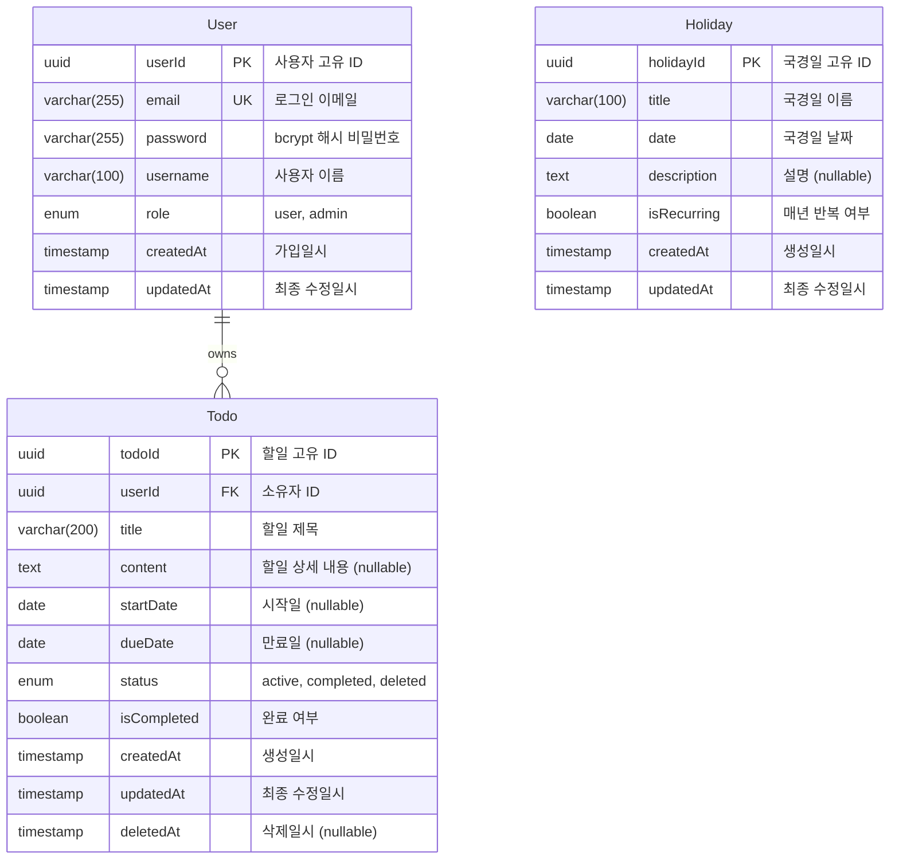

# WHS-TodoList Entity Relationship Diagram (ERD)

**버전**: 1.0
**작성일**: 2025-11-26
**상태**: 최종
**작성자**: Claude
**참조 문서**:
- [도메인 정의서](./1-domain-definition.md)
- [PRD](./3-prd.md)

---

## 목차

1. [개요](#1-개요)
2. [ERD 다이어그램](#2-erd-다이어그램)
3. [엔티티 상세 명세](#3-엔티티-상세-명세)
4. [관계 상세](#4-관계-상세)
5. [Prisma 스키마](#5-prisma-스키마)
6. [인덱스 전략](#6-인덱스-전략)
7. [데이터 제약사항](#7-데이터-제약사항)

---

## 1. 개요

### 1.1 데이터 모델 설명

WHS-TodoList는 3개의 주요 엔티티로 구성됩니다:
- **User**: 사용자 계정 정보
- **Todo**: 사용자별 할일 항목
- **Holiday**: 공통 국경일 정보

### 1.2 주요 특징

- JWT 기반 인증을 위한 사용자 관리
- 소프트 삭제를 통한 할일 복원 기능
- 사용자별 할일 격리 (1:N 관계)
- 공통 국경일 데이터 (관계 없음)

---

## 2. ERD 다이어그램

### 2.1 Mermaid ERD



### 2.2 텍스트 기반 ERD

```
┌──────────────────────────┐
│          User            │
├──────────────────────────┤
│ PK  userId (UUID)        │
│ UK  email                │
│     password             │
│     username             │
│     role                 │
│     createdAt            │
│     updatedAt            │
└─────────┬────────────────┘
          │
          │ 1:N (owns)
          │
          ▼
┌──────────────────────────┐
│          Todo            │
├──────────────────────────┤
│ PK  todoId (UUID)        │
│ FK  userId               │
│     title                │
│     content              │
│     startDate            │
│     dueDate              │
│     status               │
│     isCompleted          │
│     createdAt            │
│     updatedAt            │
│     deletedAt            │
└──────────────────────────┘

┌──────────────────────────┐
│        Holiday           │
├──────────────────────────┤
│ PK  holidayId (UUID)     │
│     title                │
│     date                 │
│     description          │
│     isRecurring          │
│     createdAt            │
│     updatedAt            │
└──────────────────────────┘
```

---

## 3. 엔티티 상세 명세

### 3.1 User (사용자)

사용자 계정 정보를 저장하는 엔티티입니다.

#### 필드 명세

| 필드명 | 데이터 타입 | 제약조건 | 기본값 | 설명 |
|--------|-------------|----------|--------|------|
| userId | UUID | PK, NOT NULL | uuid() | 사용자 고유 식별자 |
| email | VARCHAR(255) | UNIQUE, NOT NULL | - | 로그인에 사용되는 이메일 주소 |
| password | VARCHAR(255) | NOT NULL | - | bcrypt로 해시된 비밀번호 |
| username | VARCHAR(100) | NOT NULL | - | 사용자 표시 이름 |
| role | ENUM('user', 'admin') | NOT NULL | 'user' | 사용자 역할 |
| createdAt | TIMESTAMP | NOT NULL | now() | 계정 생성 일시 |
| updatedAt | TIMESTAMP | NOT NULL | now() | 최종 수정 일시 (자동 업데이트) |

#### 비즈니스 규칙

- [BR-01] 인증된 사용자만 시스템 접근 가능
- [BR-02] 사용자는 자신의 할일만 조회/수정/삭제 가능
- [BR-04] 관리자(role='admin')만 국경일 추가/수정 권한
- Email은 고유해야 하며, 중복 가입 불가
- 비밀번호는 bcrypt salt rounds 10으로 해싱
- 사용자 삭제 시 CASCADE로 관련 할일도 삭제

#### 인덱스

| 인덱스명 | 타입 | 컬럼 | 목적 |
|----------|------|------|------|
| PK_User | PRIMARY KEY | userId | 기본 키 |
| UK_User_Email | UNIQUE | email | 이메일 중복 방지 및 로그인 조회 |
| IDX_User_Role | INDEX | role | 관리자 사용자 조회 |

---

### 3.2 Todo (할일)

사용자별 할일 항목을 저장하는 엔티티입니다.

#### 필드 명세

| 필드명 | 데이터 타입 | 제약조건 | 기본값 | 설명 |
|--------|-------------|----------|--------|------|
| todoId | UUID | PK, NOT NULL | uuid() | 할일 고유 식별자 |
| userId | UUID | FK, NOT NULL | - | 할일 소유자 ID (User 참조) |
| title | VARCHAR(200) | NOT NULL | - | 할일 제목 |
| content | TEXT | NULL | - | 할일 상세 내용 |
| startDate | DATE | NULL | - | 할일 시작일 |
| dueDate | DATE | NULL | - | 할일 만료일 |
| status | ENUM('active', 'completed', 'deleted') | NOT NULL | 'active' | 할일 상태 |
| isCompleted | BOOLEAN | NOT NULL | false | 완료 여부 플래그 |
| createdAt | TIMESTAMP | NOT NULL | now() | 할일 생성 일시 |
| updatedAt | TIMESTAMP | NOT NULL | now() | 최종 수정 일시 (자동 업데이트) |
| deletedAt | TIMESTAMP | NULL | - | 소프트 삭제 일시 |

#### 비즈니스 규칙

- [BR-02] 사용자는 자신의 할일만 조회/수정/삭제 가능
- [BR-05] 할일 삭제 시 휴지통으로 이동 (status='deleted', deletedAt 기록)
- [BR-06] 휴지통의 할일은 복원 가능 (status='active', deletedAt=null)
- [BR-07] 영구 삭제 시 DB에서 완전히 제거
- [BR-08] 할일 완료 시 isCompleted=true, status='completed'
- [BR-12] 만료일은 시작일과 같거나 이후여야 함 (dueDate >= startDate)
- [BR-13] 만료일 지난 할일은 UI에서 시각적 구분

#### 제약조건

| 제약조건명 | 타입 | 조건 | 설명 |
|-----------|------|------|------|
| FK_Todo_User | FOREIGN KEY | userId REFERENCES User(userId) | 사용자 참조 |
| FK_Todo_User_Cascade | ON DELETE CASCADE | - | 사용자 삭제 시 할일도 삭제 |
| CHK_Todo_DateRange | CHECK | dueDate IS NULL OR startDate IS NULL OR dueDate >= startDate | 만료일은 시작일 이후 |

#### 인덱스

| 인덱스명 | 타입 | 컬럼 | 목적 |
|----------|------|------|------|
| PK_Todo | PRIMARY KEY | todoId | 기본 키 |
| IDX_Todo_UserId_Status | INDEX | userId, status | 사용자별 상태 조회 (활성/완료/삭제) |
| IDX_Todo_DueDate | INDEX | dueDate | 만료일 기준 정렬 및 검색 |
| IDX_Todo_DeletedAt | INDEX | deletedAt | 휴지통 조회 및 소프트 삭제 필터링 |

---

### 3.3 Holiday (국경일)

공통 국경일 정보를 저장하는 엔티티입니다.

#### 필드 명세

| 필드명 | 데이터 타입 | 제약조건 | 기본값 | 설명 |
|--------|-------------|----------|--------|------|
| holidayId | UUID | PK, NOT NULL | uuid() | 국경일 고유 식별자 |
| title | VARCHAR(100) | NOT NULL | - | 국경일 이름 (예: 신정, 설날) |
| date | DATE | NOT NULL | - | 국경일 날짜 |
| description | TEXT | NULL | - | 국경일 설명 |
| isRecurring | BOOLEAN | NOT NULL | true | 매년 반복 여부 |
| createdAt | TIMESTAMP | NOT NULL | now() | 국경일 생성 일시 |
| updatedAt | TIMESTAMP | NOT NULL | now() | 최종 수정 일시 (자동 업데이트) |

#### 비즈니스 규칙

- [BR-03] 모든 인증된 사용자가 조회 가능
- [BR-04] 관리자(role='admin')만 추가/수정 권한
- [BR-09] 관리자만 추가/수정 가능
- [BR-10] 국경일은 삭제 불가
- [BR-11] 매년 반복되는 일정 지원 (isRecurring=true)

#### 인덱스

| 인덱스명 | 타입 | 컬럼 | 목적 |
|----------|------|------|------|
| PK_Holiday | PRIMARY KEY | holidayId | 기본 키 |
| IDX_Holiday_Date | INDEX | date | 날짜 기준 조회 및 정렬 |

---

## 4. 관계 상세

### 4.1 User - Todo (1:N)

**관계 타입**: One-to-Many (일대다)
**소유자**: User
**참조자**: Todo

#### 관계 설명

- 한 명의 사용자(User)는 여러 개의 할일(Todo)을 소유할 수 있습니다.
- 각 할일(Todo)은 정확히 한 명의 사용자(User)에게만 속합니다.

#### 외래 키

- **컬럼**: Todo.userId
- **참조**: User.userId
- **삭제 규칙**: CASCADE (사용자 삭제 시 할일도 삭제)
- **업데이트 규칙**: CASCADE

#### 비즈니스 규칙

- 사용자는 자신의 할일만 조회/수정/삭제 가능
- 타인의 할일에 접근 시 403 Forbidden 응답
- 사용자 삭제 시 관련된 모든 할일도 함께 삭제

---

### 4.2 Holiday (독립 엔티티)

**관계 타입**: None (독립 엔티티)

#### 관계 설명

- Holiday는 다른 엔티티와 외래 키 관계를 맺지 않습니다.
- 모든 사용자가 공통으로 조회하는 읽기 전용 데이터입니다.
- 관리자만 생성/수정할 수 있으며, 삭제는 불가능합니다.

---

## 5. Prisma 스키마

### 5.1 완전한 Prisma Schema

```prisma
// datasource 설정
datasource db {
  provider = "postgresql"
  url      = env("DATABASE_URL")
}

// generator 설정
generator client {
  provider = "prisma-client-js"
}

// User 모델
model User {
  userId    String   @id @default(uuid())
  email     String   @unique
  password  String
  username  String
  role      Role     @default(USER)
  createdAt DateTime @default(now())
  updatedAt DateTime @updatedAt

  // 관계
  todos     Todo[]

  // 인덱스
  @@index([role])
  @@map("users")
}

// Todo 모델
model Todo {
  todoId      String     @id @default(uuid())
  userId      String
  title       String
  content     String?
  startDate   DateTime?
  dueDate     DateTime?
  status      TodoStatus @default(ACTIVE)
  isCompleted Boolean    @default(false)
  createdAt   DateTime   @default(now())
  updatedAt   DateTime   @updatedAt
  deletedAt   DateTime?

  // 관계
  user        User       @relation(fields: [userId], references: [userId], onDelete: Cascade)

  // 인덱스
  @@index([userId, status])
  @@index([dueDate])
  @@index([deletedAt])
  @@map("todos")
}

// Holiday 모델
model Holiday {
  holidayId   String   @id @default(uuid())
  title       String
  date        DateTime
  description String?
  isRecurring Boolean  @default(true)
  createdAt   DateTime @default(now())
  updatedAt   DateTime @updatedAt

  // 인덱스
  @@index([date])
  @@map("holidays")
}

// Enum: Role
enum Role {
  USER
  ADMIN
}

// Enum: TodoStatus
enum TodoStatus {
  ACTIVE
  COMPLETED
  DELETED
}
```

### 5.2 Prisma Schema 주요 특징

#### 5.2.1 데이터베이스 설정

- **Provider**: PostgreSQL (Supabase 호스팅)
- **Connection**: DATABASE_URL 환경 변수 사용
- **Client**: Prisma Client JS 생성

#### 5.2.2 모델 매핑

- User → users 테이블
- Todo → todos 테이블
- Holiday → holidays 테이블

#### 5.2.3 관계 설정

```prisma
// User.todos: User가 여러 Todo를 소유
todos     Todo[]

// Todo.user: Todo가 User를 참조
user      User   @relation(fields: [userId], references: [userId], onDelete: Cascade)
```

#### 5.2.4 기본값 및 자동 생성

- UUID: `@default(uuid())`
- 생성 일시: `@default(now())`
- 수정 일시: `@updatedAt` (자동 업데이트)
- Enum 기본값: `@default(USER)`, `@default(ACTIVE)`

---

## 6. 인덱스 전략

### 6.1 인덱스 개요

성능 최적화를 위해 다음 쿼리 패턴에 대한 인덱스를 설계했습니다:
- 사용자별 할일 조회 (빈번)
- 상태별 할일 필터링 (활성/완료/삭제)
- 날짜 기준 정렬 및 검색
- 휴지통 조회

### 6.2 User 테이블 인덱스

| 인덱스 | 컬럼 | 카디널리티 | 예상 사용 빈도 | 목적 |
|--------|------|-----------|---------------|------|
| PRIMARY KEY | userId | 매우 높음 | 매우 높음 | 기본 키 조회 |
| UNIQUE | email | 매우 높음 | 높음 | 로그인 시 이메일 조회 |
| INDEX | role | 낮음 | 낮음 | 관리자 사용자 필터링 |

#### 예상 쿼리

```sql
-- 로그인
SELECT * FROM users WHERE email = ?

-- 관리자 조회
SELECT * FROM users WHERE role = 'ADMIN'
```

### 6.3 Todo 테이블 인덱스

| 인덱스 | 컬럼 | 카디널리티 | 예상 사용 빈도 | 목적 |
|--------|------|-----------|---------------|------|
| PRIMARY KEY | todoId | 매우 높음 | 높음 | 기본 키 조회 |
| COMPOSITE INDEX | userId, status | 높음 | 매우 높음 | 사용자별 상태 필터링 |
| INDEX | dueDate | 높음 | 높음 | 만료일 정렬 및 검색 |
| INDEX | deletedAt | 중간 | 중간 | 휴지통 조회 |

#### 예상 쿼리

```sql
-- 사용자별 활성 할일 조회 (가장 빈번)
SELECT * FROM todos
WHERE userId = ? AND status = 'ACTIVE'
ORDER BY dueDate ASC

-- 휴지통 조회
SELECT * FROM todos
WHERE userId = ? AND status = 'DELETED'
ORDER BY deletedAt DESC

-- 만료 예정 할일 조회
SELECT * FROM todos
WHERE userId = ? AND status = 'ACTIVE' AND dueDate <= ?
ORDER BY dueDate ASC
```

#### 복합 인덱스 설계 이유

`(userId, status)` 복합 인덱스:
- 가장 빈번한 쿼리 패턴: "특정 사용자의 특정 상태 할일 조회"
- userId로 먼저 필터링 후 status로 추가 필터링
- 인덱스 순서가 중요: userId (높은 선택도) → status (낮은 선택도)

### 6.4 Holiday 테이블 인덱스

| 인덱스 | 컬럼 | 카디널리티 | 예상 사용 빈도 | 목적 |
|--------|------|-----------|---------------|------|
| PRIMARY KEY | holidayId | 매우 높음 | 낮음 | 기본 키 조회 |
| INDEX | date | 높음 | 높음 | 날짜 기준 조회 및 정렬 |

#### 예상 쿼리

```sql
-- 특정 연도 국경일 조회
SELECT * FROM holidays
WHERE EXTRACT(YEAR FROM date) = ?
ORDER BY date ASC

-- 특정 월 국경일 조회
SELECT * FROM holidays
WHERE date >= ? AND date < ?
ORDER BY date ASC
```

### 6.5 인덱스 성능 예상

**예상 데이터 규모**:
- Users: 1,000명
- Todos: 20,000개 (사용자당 평균 20개)
- Holidays: 100개 (연간 15-20개)

**인덱스 효율**:
- User 이메일 조회: O(log n) ≈ 10회 비교
- Todo 사용자별 조회: O(log n) ≈ 15회 비교
- 복합 인덱스 사용 시 전체 테이블 스캔 대비 99% 성능 향상

---

## 7. 데이터 제약사항

### 7.1 필수 입력 필드 (NOT NULL)

#### User
- userId (자동 생성)
- email
- password
- username
- role (기본값: 'user')
- createdAt (자동 생성)
- updatedAt (자동 생성)

#### Todo
- todoId (자동 생성)
- userId (외래 키)
- title
- status (기본값: 'active')
- isCompleted (기본값: false)
- createdAt (자동 생성)
- updatedAt (자동 생성)

#### Holiday
- holidayId (자동 생성)
- title
- date
- isRecurring (기본값: true)
- createdAt (자동 생성)
- updatedAt (자동 생성)

### 7.2 고유성 제약 (UNIQUE)

| 테이블 | 컬럼 | 제약사항 | 비즈니스 규칙 |
|--------|------|----------|---------------|
| User | email | UNIQUE | 이메일 중복 불가, 중복 시 409 Conflict |

### 7.3 외래 키 제약 (FOREIGN KEY)

| 자식 테이블 | 자식 컬럼 | 부모 테이블 | 부모 컬럼 | ON DELETE | ON UPDATE |
|------------|----------|------------|----------|-----------|-----------|
| Todo | userId | User | userId | CASCADE | CASCADE |

**CASCADE 규칙**:
- 사용자 삭제 시 해당 사용자의 모든 할일도 삭제
- 사용자 ID 변경 시 할일의 userId도 자동 업데이트

### 7.4 체크 제약 (CHECK)

| 테이블 | 제약조건명 | 조건 | 설명 |
|--------|-----------|------|------|
| Todo | CHK_Todo_DateRange | `dueDate IS NULL OR startDate IS NULL OR dueDate >= startDate` | 만료일은 시작일 이후여야 함 |

**Prisma 구현**:
```prisma
// Prisma에서는 애플리케이션 레벨에서 검증
// 또는 마이그레이션 파일에서 직접 추가
```

### 7.5 데이터 타입 제약

| 필드 | 타입 | 최대 길이 | 형식 |
|------|------|----------|------|
| User.email | VARCHAR | 255 | 유효한 이메일 형식 |
| User.password | VARCHAR | 255 | bcrypt 해시 (60자) |
| User.username | VARCHAR | 100 | - |
| Todo.title | VARCHAR | 200 | - |
| Todo.content | TEXT | 무제한 | - |
| Holiday.title | VARCHAR | 100 | - |
| Holiday.description | TEXT | 무제한 | - |

### 7.6 Enum 제약

#### Role (사용자 역할)
```typescript
enum Role {
  USER   // 일반 사용자
  ADMIN  // 관리자
}
```

#### TodoStatus (할일 상태)
```typescript
enum TodoStatus {
  ACTIVE     // 활성 (진행 중)
  COMPLETED  // 완료
  DELETED    // 삭제 (휴지통)
}
```

### 7.7 날짜/시간 제약

| 필드 | 타입 | 제약사항 | 기본값 |
|------|------|----------|--------|
| createdAt | TIMESTAMP | NOT NULL | now() |
| updatedAt | TIMESTAMP | NOT NULL, 자동 업데이트 | now() |
| deletedAt | TIMESTAMP | NULL | - |
| startDate | DATE | NULL | - |
| dueDate | DATE | NULL, >= startDate | - |
| Holiday.date | DATE | NOT NULL | - |

### 7.8 비즈니스 규칙 기반 제약

#### 사용자 인증
- [BR-01] 인증된 사용자만 접근 가능
- 비밀번호는 bcrypt salt rounds 10으로 해싱
- JWT Access Token 유효기간: 15분
- JWT Refresh Token 유효기간: 7일

#### 할일 관리
- [BR-02] 사용자는 자신의 할일만 접근 가능
- [BR-05] 삭제 시 소프트 삭제 (status='deleted', deletedAt 기록)
- [BR-06] 휴지통에서 복원 가능
- [BR-07] 영구 삭제 시 DB에서 완전 제거
- [BR-08] 완료 시 isCompleted=true, status='completed'
- [BR-12] dueDate >= startDate
- [BR-13] 만료일 지난 할일 시각적 구분

#### 국경일 관리
- [BR-03] 모든 인증 사용자 조회 가능
- [BR-04] 관리자만 추가/수정 가능
- [BR-10] 국경일 삭제 불가
- [BR-11] 매년 반복 일정 지원

### 7.9 애플리케이션 레벨 검증

Prisma/백엔드에서 추가로 검증해야 할 항목:

```typescript
// 이메일 형식 검증
const emailRegex = /^[^\s@]+@[^\s@]+\.[^\s@]+$/;

// 비밀번호 최소 길이
const MIN_PASSWORD_LENGTH = 8;

// 제목 최소 길이
const MIN_TITLE_LENGTH = 1;
const MAX_TITLE_LENGTH = 200;

// 날짜 범위 검증
if (dueDate && startDate && dueDate < startDate) {
  throw new Error('만료일은 시작일 이후여야 합니다');
}

// 권한 검증
if (user.role !== 'ADMIN' && action === 'CREATE_HOLIDAY') {
  throw new Error('관리자 권한이 필요합니다');
}
```

---

## 8. 마이그레이션 전략

### 8.1 초기 마이그레이션

```bash
# Prisma 초기화
npx prisma init

# 스키마 작성 후 마이그레이션 생성
npx prisma migrate dev --name init

# Prisma Client 생성
npx prisma generate
```

### 8.2 시드 데이터

```typescript
// prisma/seed.ts
import { PrismaClient } from '@prisma/client';
import bcrypt from 'bcrypt';

const prisma = new PrismaClient();

async function main() {
  // 관리자 계정 생성
  const adminPassword = await bcrypt.hash('admin123', 10);
  const admin = await prisma.user.upsert({
    where: { email: 'admin@whs-todo.com' },
    update: {},
    create: {
      email: 'admin@whs-todo.com',
      password: adminPassword,
      username: '관리자',
      role: 'ADMIN',
    },
  });

  // 국경일 데이터 생성
  const holidays = [
    { title: '신정', date: new Date('2025-01-01'), description: '새해 첫날', isRecurring: true },
    { title: '설날', date: new Date('2025-01-29'), description: '음력 1월 1일', isRecurring: true },
    { title: '삼일절', date: new Date('2025-03-01'), description: '3.1 독립운동 기념일', isRecurring: true },
    { title: '어린이날', date: new Date('2025-05-05'), description: '어린이날', isRecurring: true },
    { title: '석가탄신일', date: new Date('2025-05-05'), description: '부처님 오신 날', isRecurring: true },
    { title: '현충일', date: new Date('2025-06-06'), description: '국가를 위해 희생한 분들을 추모', isRecurring: true },
    { title: '광복절', date: new Date('2025-08-15'), description: '대한민국 독립 기념일', isRecurring: true },
    { title: '추석', date: new Date('2025-10-06'), description: '음력 8월 15일', isRecurring: true },
    { title: '개천절', date: new Date('2025-10-03'), description: '단군왕검이 고조선을 건국한 날', isRecurring: true },
    { title: '한글날', date: new Date('2025-10-09'), description: '세종대왕이 훈민정음을 반포한 날', isRecurring: true },
    { title: '성탄절', date: new Date('2025-12-25'), description: '예수 탄생일', isRecurring: true },
  ];

  for (const holiday of holidays) {
    await prisma.holiday.upsert({
      where: { holidayId: holiday.title }, // 임시 unique 조건
      update: {},
      create: holiday,
    });
  }

  console.log('시드 데이터 생성 완료');
}

main()
  .catch((e) => {
    console.error(e);
    process.exit(1);
  })
  .finally(async () => {
    await prisma.$disconnect();
  });
```

---

## 9. 참조

### 9.1 관련 문서

- [도메인 정의서](./1-domain-definition.md)
- [PRD](./3-prd.md)
- [Prisma 공식 문서](https://www.prisma.io/docs)
- [PostgreSQL 공식 문서](https://www.postgresql.org/docs/)

### 9.2 변경 이력

| 버전 | 날짜 | 변경 내용 | 작성자 |
|------|------|----------|--------|
| 1.0 | 2025-11-26 | 초안 작성 | Claude |

---

**문서 종료**
